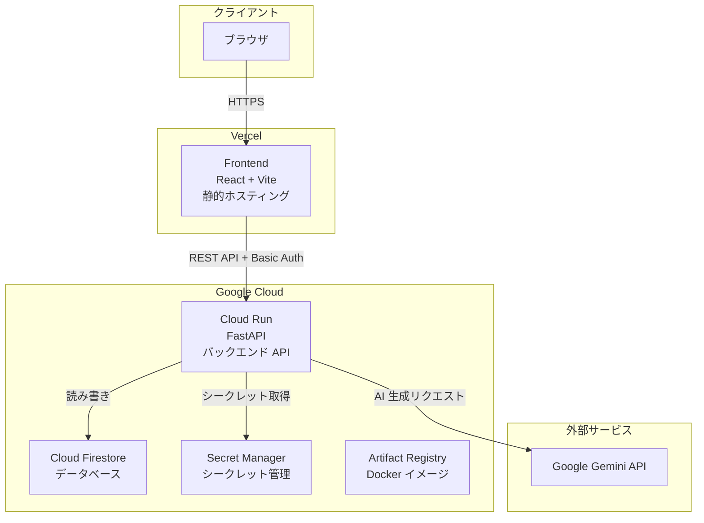
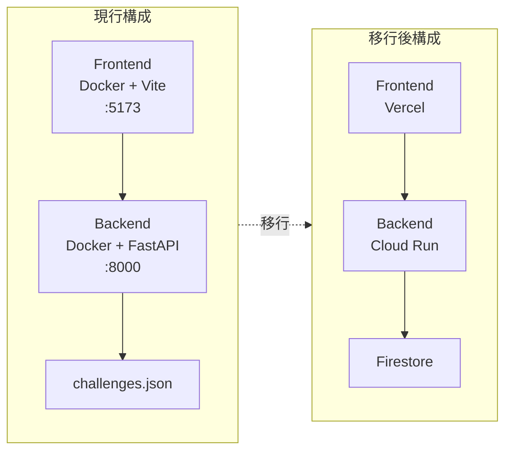
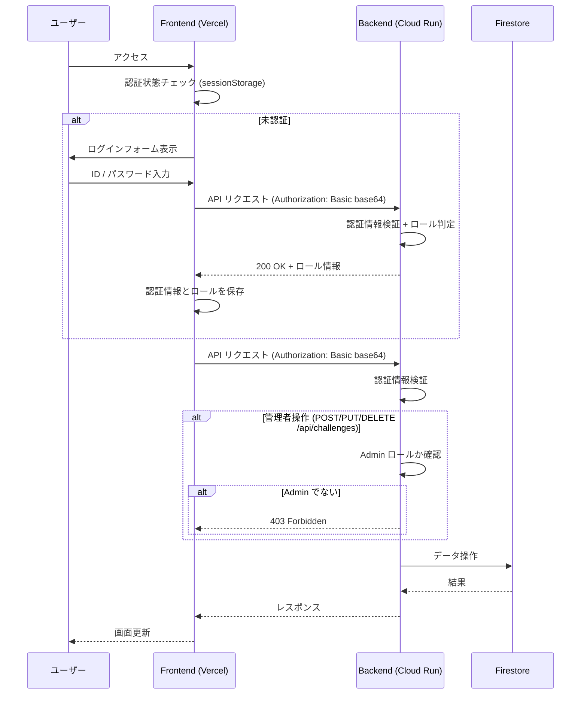
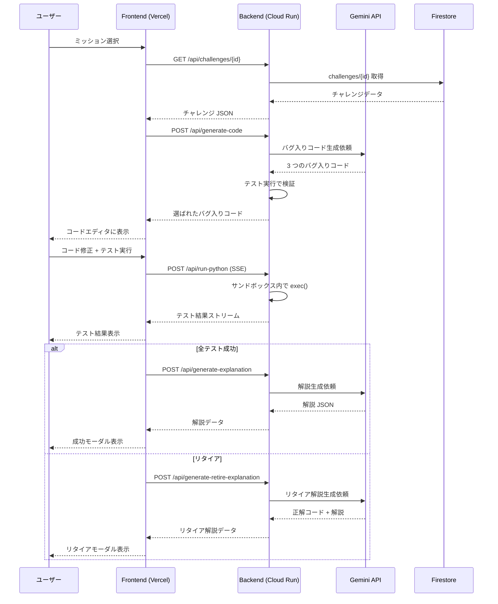
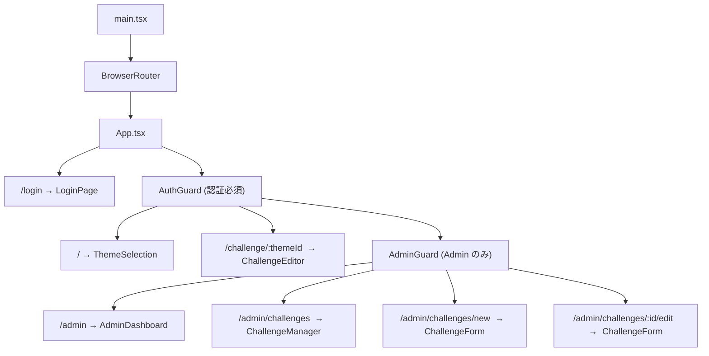

# 新アーキテクチャ設計書

## 概要

Debug Master を Docker Compose によるローカル構成から、Google Cloud (Cloud Run, Firestore) + Vercel によるクラウド構成に移行する。認証には Basic 認証を採用し、User 権限と Admin 権限の 2 アカウントでアクセス制御を行う。

## 技術スタック (移行後)

| レイヤー | 技術 | 備考 |
|---|---|---|
| **フロントエンド** | React 18 + TypeScript + Vite | 変更なし |
| **ホスティング (FE)** | Vercel | GitHub 連携で自動デプロイ |
| **バックエンド** | Python 3.13 + FastAPI | 変更なし |
| **ホスティング (BE)** | Google Cloud Run | Docker コンテナで実行 |
| **データベース** | Cloud Firestore | JSON ファイルから移行 |
| **認証** | Basic 認証 | User / Admin の 2 アカウント |
| **AI** | Google Gemini API | 変更なし |
| **シークレット管理** | Google Secret Manager | API キー等を安全に管理 |
| **コンテナレジストリ** | Artifact Registry | Docker イメージの保存 |
| **CI/CD** | GitHub Actions | 自動テスト・デプロイ |

## サービス構成図



## 現行構成との比較



## 認証フロー

Basic 認証により、User 権限と Admin 権限の 2 つのアカウントでアクセス制御を行う。メンバー管理は行わず、ID/パスワードを知っている人のみがアクセスできる。



## データフロー (チャレンジ利用)



## ルーティング (移行後)

| パス | コンポーネント | 認証 | 説明 |
|---|---|---|---|
| `/login` | `LoginPage` | 不要 | ID/パスワード入力画面 |
| `/` | `ThemeSelection` | User 以上 | ホーム画面。ミッション一覧 |
| `/challenge/:themeId` | `ChallengeEditor` | User 以上 | チャレンジ画面 |
| `/admin` | `AdminDashboard` | Admin のみ | 管理者ダッシュボード |
| `/admin/challenges` | `ChallengeManager` | Admin のみ | チャレンジ CRUD 管理 |
| `/admin/challenges/new` | `ChallengeForm` | Admin のみ | チャレンジ新規作成 |
| `/admin/challenges/:id/edit` | `ChallengeForm` | Admin のみ | チャレンジ編集 |



## ディレクトリ構成 (移行後の変更点)

```
debug-master/
├── frontend/
│   ├── src/
│   │   ├── components/
│   │   │   ├── LoginPage.tsx          # [新規] ログイン画面
│   │   │   ├── ThemeSelection.tsx
│   │   │   └── ...
│   │   ├── admin/                     # [新規] 管理者画面
│   │   │   ├── AdminDashboard.tsx
│   │   │   ├── ChallengeManager.tsx
│   │   │   └── ChallengeForm.tsx
│   │   ├── config/
│   │   │   └── api.ts
│   │   ├── contexts/                  # [新規] コンテキスト
│   │   │   └── AuthContext.tsx        # Basic 認証の状態管理
│   │   ├── guards/                    # [新規] ルートガード
│   │   │   ├── AuthGuard.tsx
│   │   │   └── AdminGuard.tsx
│   │   ├── hooks/
│   │   ├── services/                  # [変更] Basic 認証ヘッダー付与
│   │   ├── types/
│   │   ├── App.tsx                    # [変更] ルート追加
│   │   ├── ChallengeEditor.tsx
│   │   └── main.tsx
│   ├── package.json
│   └── ...
│
├── backend/
│   ├── api/
│   │   └── challenges.py              # [変更] 認証チェック追加
│   ├── database/
│   │   ├── challenge_repository.py    # [変更] Firestore クライアントに書き換え
│   │   └── models/
│   │       └── challenge.py
│   ├── middleware/                     # [新規] ミドルウェア
│   │   └── auth.py                    # Basic 認証検証
│   ├── app.py                         # [変更] CORS、認証ミドルウェア追加
│   ├── config.py                      # [変更] Secret Manager 統合
│   ├── code_runner.py                 # [変更] セキュリティ強化
│   ├── gemini_utils.py
│   ├── requirements.txt               # [変更] GCP パッケージ追加
│   ├── Dockerfile                     # [変更] 最適化
│   └── .env                           # ローカル開発用のみ
│
├── .github/                           # [新規]
│   └── workflows/
│       ├── deploy-backend.yml
│       └── test.yml
│
├── docs/                              # 現行仕様ドキュメント
├── docs-new/                          # クラウド化改修計画
├── compose.yml                        # ローカル開発専用に整理
├── README.md                          # [変更] クラウド構成に更新
└── LICENSE
```

> `agents/` ディレクトリは削除される。

## API エンドポイント (変更点)

既存の API エンドポイントは基本的に維持し、認証のみ追加する。

> `Challenge` データモデルから `image` / `video` フィールドは廃止。サムネイル画像は使用せず、キャラクター画像等はソースコードに含める。これに伴い、`VideoModal` コンポーネントを削除し、問題一覧画面 (`ThemeSelection`) のUI をサムネイル無しのレイアウトに変更する。

| メソッド | パス | 認証 | 変更点 |
|---|---|---|---|
| GET | `/api/health` | なし | 変更なし |
| GET | `/api/challenges` | 必要 | 認証チェック追加 |
| GET | `/api/challenges/{id}` | 必要 | 認証チェック追加 |
| POST | `/api/challenges` | 管理者 | 認証 + 管理者チェック追加 |
| PUT | `/api/challenges/{id}` | 管理者 | 認証 + 管理者チェック追加 |
| DELETE | `/api/challenges/{id}` | 管理者 | 認証 + 管理者チェック追加 |
| POST | `/api/run-python` | 必要 | 認証チェック追加 |
| POST | `/api/generate-code` | 必要 | 認証チェック追加 |
| POST | `/api/generate-hint` | 必要 | 認証チェック追加 |
| POST | `/api/generate-explanation` | 必要 | 認証チェック追加 |
| POST | `/api/generate-retire-explanation` | 必要 | 認証チェック追加 |

## 関連ドキュメント

- 移行計画 → [migration-plan.md](./migration-plan.md)
- インフラ構成 → [infrastructure.md](./infrastructure.md)
- セキュリティ設計 → [security.md](./security.md)
- DB 移行設計 → [database-migration.md](./database-migration.md)
- 現行アーキテクチャ → [../docs/architecture.md](../docs/architecture.md)
