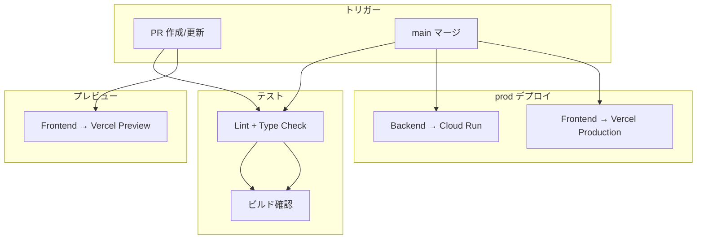
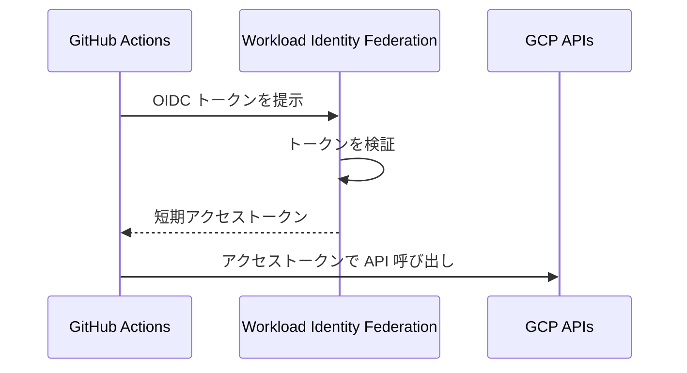
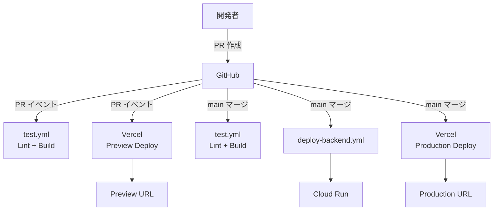

# CI/CD パイプライン

## 概要

GitHub Actions を使用してバックエンドの自動テスト・デプロイを行う。フロントエンドは Vercel の GitHub 連携による自動デプロイを利用する。

## パイプライン全体像



## ワークフロー一覧

| ワークフロー | ファイル | トリガー | 内容 |
|---|---|---|---|
| テスト | `.github/workflows/test.yml` | PR, push to main | Lint、型チェック、ビルド確認 |
| バックエンドデプロイ | `.github/workflows/deploy-backend.yml` | push to main | Cloud Run へのデプロイ |
| フロントエンドデプロイ | Vercel GitHub 連携 | PR / push to main | Preview / Production デプロイ |

---

## テストワークフロー

### `.github/workflows/test.yml`

```yaml
name: Test

on:
  pull_request:
    branches: [main]
  push:
    branches: [main]

jobs:
  frontend-lint:
    name: Frontend Lint & Build
    runs-on: ubuntu-latest
    defaults:
      run:
        working-directory: frontend
    steps:
      - uses: actions/checkout@v4

      - uses: actions/setup-node@v4
        with:
          node-version: '20'
          cache: 'npm'
          cache-dependency-path: frontend/package-lock.json

      - run: npm ci
      - run: npm run lint
      - run: npm run build

  backend-lint:
    name: Backend Lint
    runs-on: ubuntu-latest
    defaults:
      run:
        working-directory: backend
    steps:
      - uses: actions/checkout@v4

      - uses: actions/setup-python@v5
        with:
          python-version: '3.13'
          cache: 'pip'
          cache-dependency-path: backend/requirements.txt

      - run: pip install ruff
      - run: ruff check .
```

---

## バックエンドデプロイワークフロー

### `.github/workflows/deploy-backend.yml`

```yaml
name: Deploy Backend

on:
  push:
    branches: [main]
    paths:
      - 'backend/**'

env:
  REGION: asia-northeast1
  SERVICE_NAME: debug-master-api
  REPOSITORY: debug-master

jobs:
  deploy:
    name: Deploy to Cloud Run
    runs-on: ubuntu-latest
    environment: production
    permissions:
      contents: read
      id-token: write
    steps:
      - uses: actions/checkout@v4

      - id: auth
        uses: google-github-actions/auth@v2
        with:
          workload_identity_provider: ${{ secrets.GCP_WORKLOAD_IDENTITY_PROVIDER }}
          service_account: ${{ secrets.GCP_SA_EMAIL }}

      - uses: google-github-actions/setup-gcloud@v2

      - name: Configure Docker for Artifact Registry
        run: gcloud auth configure-docker ${{ env.REGION }}-docker.pkg.dev

      - name: Build and Push Docker Image
        run: |
          IMAGE=${{ env.REGION }}-docker.pkg.dev/${{ secrets.GCP_PROJECT_ID }}/${{ env.REPOSITORY }}/api:${{ github.sha }}
          docker build -t $IMAGE backend/
          docker push $IMAGE

      - name: Deploy to Cloud Run
        run: |
          gcloud run deploy ${{ env.SERVICE_NAME }} \
            --image ${{ env.REGION }}-docker.pkg.dev/${{ secrets.GCP_PROJECT_ID }}/${{ env.REPOSITORY }}/api:${{ github.sha }} \
            --region ${{ env.REGION }} \
            --project ${{ secrets.GCP_PROJECT_ID }} \
            --platform managed \
            --allow-unauthenticated \
            --min-instances 1 \
            --max-instances 10 \
            --set-env-vars "ENVIRONMENT=prod,ALLOWED_ORIGINS=https://debug-master.vercel.app" \
            --set-secrets "GEMINI_API_KEY=gemini-api-key:latest"
```

---

## フロントエンドデプロイ (Vercel)

Vercel の GitHub 連携を使用し、ワークフローの作成は不要。

### 設定手順

1. Vercel ダッシュボードで「New Project」→ GitHub リポジトリを選択
2. Root Directory を `frontend/` に設定
3. Framework Preset を `Vite` に設定
4. 環境変数を設定

### デプロイフロー

| イベント | Vercel の挙動 |
|---|---|
| PR 作成/更新 | Preview デプロイ (一意の URL が発行される) |
| main マージ | Production デプロイ |

### 環境変数の設定

Vercel ダッシュボードの「Settings > Environment Variables」で設定する。

| 変数名 | 値 |
|---|---|
| `VITE_API_BASE_URL` | Cloud Run の URL |

---

## GitHub Secrets / Variables の一覧

### GitHub Environments

`production` Environment を作成する。

### Secrets

| シークレット名 | 説明 |
|---|---|
| `GCP_PROJECT_ID` | GCP プロジェクト ID |
| `GCP_WORKLOAD_IDENTITY_PROVIDER` | Workload Identity Federation プロバイダ |
| `GCP_SA_EMAIL` | GitHub Actions 用サービスアカウントのメールアドレス |

### 認証方式: Workload Identity Federation

サービスアカウントキー JSON の管理を避けるため、Workload Identity Federation を使用する。



#### セットアップ手順 (参考)

```bash
# Workload Identity Pool の作成
gcloud iam workload-identity-pools create "github-pool" \
  --location="global" \
  --display-name="GitHub Actions Pool"

# Workload Identity Provider の作成
gcloud iam workload-identity-pools providers create-oidc "github-provider" \
  --location="global" \
  --workload-identity-pool="github-pool" \
  --display-name="GitHub Provider" \
  --attribute-mapping="google.subject=assertion.sub,attribute.repository=assertion.repository" \
  --issuer-uri="https://token.actions.githubusercontent.com"

# サービスアカウントへのバインド
gcloud iam service-accounts add-iam-policy-binding \
  "github-actions@PROJECT_ID.iam.gserviceaccount.com" \
  --role="roles/iam.workloadIdentityUser" \
  --member="principalSet://iam.googleapis.com/projects/PROJECT_NUMBER/locations/global/workloadIdentityPools/github-pool/attribute.repository/OWNER/REPO"
```

---

## GitHub Actions 用サービスアカウントの IAM ロール

| ロール | 目的 |
|---|---|
| `roles/run.developer` | Cloud Run サービスのデプロイ |
| `roles/artifactregistry.writer` | Docker イメージのプッシュ |
| `roles/iam.serviceAccountUser` | Cloud Run サービスアカウントの使用 |

---

## デプロイフロー (まとめ)



## 関連ドキュメント

- 移行計画 → [migration-plan.md](./migration-plan.md)
- インフラ構成 → [infrastructure.md](./infrastructure.md)
- セキュリティ設計 → [security.md](./security.md)
