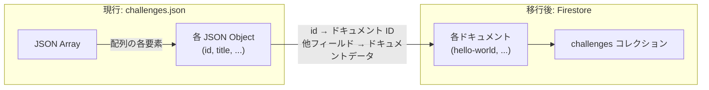
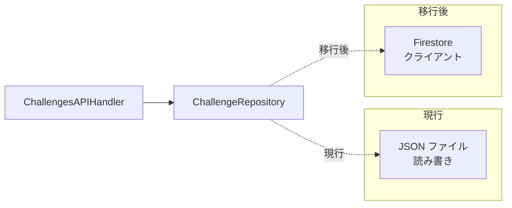

# DB 移行設計 (JSON → Firestore)

## 概要

現在 `backend/database/data/challenges.json` で管理しているチャレンジデータを Cloud Firestore に移行する。加えて、Firebase Authentication と連携する `users` コレクションを新規に設計する。

## 現行のデータ構造

### challenges.json

```json
[
  {
    "id": "hello-world",
    "title": "はじめてのプログラム",
    "description": "自分の名前を表示するプログラムを作成します。...",
    "difficulty": "入門",
    "image": "images/character.png?auto=format&fit=crop&w=800&q=80",
    "languages": ["Python"],
    "instructions": "自分の名前を「こんにちは、〇〇です！」の形で...",
    "examples": "例:\nname = \"花子\"\n出力: こんにちは、花子です！",
    "video": "/videos/hello-world.mp4",
    "testCases": [
      { "input": "太郎", "expected": "こんにちは、太郎です！" },
      { "input": "花子", "expected": "こんにちは、花子です！" }
    ]
  }
]
```

### 現行チャレンジ一覧

| ID | タイトル | 難易度 |
|---|---|---|
| `hello-world` | はじめてのプログラム | 入門 |
| `age-calculator` | 年齢計算プログラム | 入門 |
| `temperature-judge` | 温度判定プログラム | 初級 |
| `sum-n` | 合計値計算プログラム | 初級 |
| `reverse-string` | 文字列反転プログラム | 初級 |
| `multiplication-table` | 掛け算九九プログラム | 初級 |

---

## Firestore コレクション設計

### challenges コレクション

JSON 配列の各要素を Firestore ドキュメントに 1:1 でマッピングする。ドキュメント ID にはチャレンジの `id` フィールドを使用する。

```
firestore/
└── challenges/              # コレクション
    ├── hello-world          # ドキュメント ID = チャレンジ ID
    │   ├── title: string
    │   ├── description: string
    │   ├── difficulty: string
    │   ├── image: string
    │   ├── languages: array<string>
    │   ├── instructions: string
    │   ├── examples: string
    │   ├── video: string
    │   └── testCases: array<map>
    │       ├── [0] { input: any, expected: any }
    │       └── [1] { input: any, expected: any }
    ├── age-calculator
    │   └── ...
    └── ...
```

#### フィールド定義

| フィールド | Firestore 型 | 説明 | 必須 |
|---|---|---|---|
| `title` | string | タイトル | Yes |
| `description` | string | 短い説明文 | Yes |
| `difficulty` | string | 難易度 | Yes |
| `image` | string | サムネイル画像パス | Yes |
| `languages` | array (string) | 対応言語 | Yes |
| `instructions` | string | 問題の仕様 | Yes |
| `examples` | string | 入出力例 | Yes |
| `video` | string | 解説動画パス | Yes |
| `testCases` | array (map) | テストケースの配列 | Yes |
| `testCases[].input` | string / number | テスト入力値 | Yes |
| `testCases[].expected` | string / number | 期待される出力値 | Yes |
| `createdAt` | timestamp | 作成日時 (新規追加) | No |
| `updatedAt` | timestamp | 更新日時 (新規追加) | No |

> `createdAt` / `updatedAt` は既存データにはないため、移行時に現在時刻を設定する。

### users コレクション (新規)

Firebase Authentication のユーザーに対応するコレクション。

```
firestore/
└── users/                   # コレクション
    ├── {firebase-uid}       # ドキュメント ID = Firebase Auth UID
    │   ├── email: string
    │   ├── displayName: string
    │   ├── role: string     # "user" | "admin"
    │   ├── createdAt: timestamp
    │   └── lastLoginAt: timestamp
    └── ...
```

#### フィールド定義

| フィールド | Firestore 型 | 説明 | 必須 |
|---|---|---|---|
| `email` | string | メールアドレス | Yes |
| `displayName` | string | 表示名 | Yes |
| `role` | string | `user` または `admin` | Yes |
| `createdAt` | timestamp | アカウント作成日時 | Yes |
| `lastLoginAt` | timestamp | 最終ログイン日時 | Yes |

---

## データマッピング

### JSON → Firestore の対応



### フィールドマッピング表

| JSON フィールド | Firestore フィールド | 型変換 | 備考 |
|---|---|---|---|
| `id` | (ドキュメント ID) | string → ドキュメント ID | ドキュメントデータには含めない |
| `title` | `title` | そのまま | - |
| `description` | `description` | そのまま | - |
| `difficulty` | `difficulty` | そのまま | - |
| `image` | `image` | そのまま | - |
| `languages` | `languages` | そのまま | - |
| `instructions` | `instructions` | そのまま | - |
| `examples` | `examples` | そのまま | - |
| `video` | `video` | そのまま | - |
| `testCases` | `testCases` | そのまま | ネストされた配列もそのまま |
| (なし) | `createdAt` | - | 移行時に現在時刻を設定 |
| (なし) | `updatedAt` | - | 移行時に現在時刻を設定 |

---

## 移行スクリプト

### スクリプトの方針

`challenges.json` を読み込み、各チャレンジを Firestore ドキュメントとして書き込む。

### スクリプト実装

```python
# scripts/migrate_to_firestore.py
"""
challenges.json から Firestore にデータを移行するスクリプト。

使い方:
  # 環境変数で GCP プロジェクトを指定
  export GOOGLE_CLOUD_PROJECT=debug-master-dev

  # サービスアカウントキーで認証 (ローカル実行時)
  export GOOGLE_APPLICATION_CREDENTIALS=path/to/key.json

  python scripts/migrate_to_firestore.py
"""

import json
import sys
from pathlib import Path

from google.cloud import firestore


def migrate_challenges(json_path: str, dry_run: bool = False):
    """challenges.json を Firestore に移行する"""

    # JSON ファイルの読み込み
    with open(json_path, "r", encoding="utf-8") as f:
        challenges = json.load(f)

    print(f"Found {len(challenges)} challenges to migrate")

    if dry_run:
        for c in challenges:
            print(f"  [DRY RUN] Would create: challenges/{c['id']}")
        return

    # Firestore クライアントの初期化
    db = firestore.Client()
    batch = db.batch()

    for challenge in challenges:
        doc_id = challenge["id"]
        doc_ref = db.collection("challenges").document(doc_id)

        # id フィールドはドキュメント ID として使用するため、データからは除外
        data = {k: v for k, v in challenge.items() if k != "id"}
        data["createdAt"] = firestore.SERVER_TIMESTAMP
        data["updatedAt"] = firestore.SERVER_TIMESTAMP

        batch.set(doc_ref, data)
        print(f"  Queued: challenges/{doc_id}")

    # バッチ書き込みの実行
    batch.commit()
    print(f"Successfully migrated {len(challenges)} challenges")


def verify_migration():
    """移行後のデータを検証する"""
    db = firestore.Client()
    docs = db.collection("challenges").stream()

    print("\nVerification:")
    count = 0
    for doc in docs:
        data = doc.to_dict()
        print(f"  {doc.id}: {data.get('title', 'NO TITLE')} ({data.get('difficulty', 'NO DIFFICULTY')})")
        count += 1

    print(f"\nTotal: {count} documents")


if __name__ == "__main__":
    json_path = Path(__file__).parent.parent / "backend" / "database" / "data" / "challenges.json"

    if not json_path.exists():
        print(f"Error: {json_path} not found")
        sys.exit(1)

    dry_run = "--dry-run" in sys.argv

    migrate_challenges(str(json_path), dry_run=dry_run)

    if not dry_run:
        verify_migration()
```

### 移行手順

1. ローカルで `--dry-run` オプションで確認

```bash
python scripts/migrate_to_firestore.py --dry-run
```

2. dev 環境に移行

```bash
export GOOGLE_CLOUD_PROJECT=debug-master-dev
python scripts/migrate_to_firestore.py
```

3. dev 環境で動作確認

4. prod 環境に移行

```bash
export GOOGLE_CLOUD_PROJECT=debug-master-prod
python scripts/migrate_to_firestore.py
```

---

## ChallengeRepository のリファクタ

### 現行の実装

```python
# backend/database/challenge_repository.py (現行)
class ChallengeRepository:
    def __init__(self, data_file_path: str):
        self.data_file_path = data_file_path

    def get_all_challenges(self) -> List[Challenge]:
        # JSON ファイルを読み込んで返す
        ...

    def get_challenge_by_id(self, challenge_id: str) -> Optional[Challenge]:
        # JSON ファイルから ID で検索
        ...
```

### 移行後の実装方針

```python
# backend/database/challenge_repository.py (移行後)
from google.cloud import firestore


class ChallengeRepository:
    def __init__(self):
        self.db = firestore.Client()
        self.collection = self.db.collection("challenges")

    def get_all_challenges(self) -> List[Challenge]:
        """全チャレンジを取得"""
        docs = self.collection.stream()
        return [
            Challenge.from_dict({"id": doc.id, **doc.to_dict()})
            for doc in docs
        ]

    def get_challenge_by_id(self, challenge_id: str) -> Optional[Challenge]:
        """ID でチャレンジを取得"""
        doc = self.collection.document(challenge_id).get()
        if not doc.exists:
            return None
        return Challenge.from_dict({"id": doc.id, **doc.to_dict()})

    def create_challenge(self, challenge: Challenge) -> Challenge:
        """チャレンジを作成"""
        doc_ref = self.collection.document(challenge.id)
        if doc_ref.get().exists:
            raise ValueError(f"Challenge with ID '{challenge.id}' already exists")

        data = challenge.to_dict()
        data.pop("id", None)
        data["createdAt"] = firestore.SERVER_TIMESTAMP
        data["updatedAt"] = firestore.SERVER_TIMESTAMP
        doc_ref.set(data)
        return challenge

    def update_challenge(self, challenge_id: str, challenge: Challenge) -> Optional[Challenge]:
        """チャレンジを更新"""
        doc_ref = self.collection.document(challenge_id)
        if not doc_ref.get().exists:
            return None

        data = challenge.to_dict()
        data.pop("id", None)
        data["updatedAt"] = firestore.SERVER_TIMESTAMP
        doc_ref.update(data)
        return challenge

    def delete_challenge(self, challenge_id: str) -> bool:
        """チャレンジを削除"""
        doc_ref = self.collection.document(challenge_id)
        if not doc_ref.get().exists:
            return False
        doc_ref.delete()
        return True
```

### API ハンドラへの影響

`ChallengesAPIHandler` はリポジトリのインターフェースに依存しているため、リポジトリの内部実装を変更してもハンドラ側の変更は最小限で済む。



変更が必要な箇所:

| ファイル | 変更内容 |
|---|---|
| `challenge_repository.py` | 全面書き換え (JSON → Firestore) |
| `api/challenges.py` | `ChallengeRepository` の初期化方法の変更 (ファイルパス引数を削除) |
| `app.py` | リポジトリ初期化コードの変更 |
| `requirements.txt` | `google-cloud-firestore` の追加 |

---

## フロントエンドへの影響

### challengesData.ts の扱い

現在、`frontend/src/challengesData.ts` にはホーム画面用の静的チャレンジデータが含まれている。クラウド移行後の選択肢:

**方針 A: API に統合 (推奨)**

`ThemeSelection` コンポーネントでも `GET /api/challenges` を使用し、`challengesData.ts` を削除する。

- メリット: データの一元管理、管理画面からの変更が即座に反映
- デメリット: 初期ロードで API 呼び出しが必要 (ローディング表示が必要)

**方針 B: 静的データを維持**

`challengesData.ts` をそのまま維持し、ホーム画面では静的データ、チャレンジ画面では API データを使う現行方式を継続。

- メリット: ホーム画面の即座な表示
- デメリット: データの二重管理が続く

> 推奨は方針 A。管理画面でチャレンジを追加・編集した際にホーム画面にも自動で反映されるため。

### TypeScript 型の変更

`Challenge` 型に `createdAt` / `updatedAt` フィールドを追加する (オプショナル)。

```typescript
interface Challenge {
  id: string;
  title: string;
  description: string;
  difficulty: string;
  image: string;
  languages: string[];
  instructions: string;
  examples: string;
  video: string;
  testCases: TestCase[];
  createdAt?: string;  // 新規追加
  updatedAt?: string;  // 新規追加
}
```

---

## ロールバック方針

移行後に問題が発生した場合のロールバック手順。

1. Cloud Run の CORS 設定を元に戻す (必要に応じて)
2. `challenge_repository.py` を JSON 版に戻す
3. `challenges.json` はリポジトリに残しておく (移行完了が確認されるまで削除しない)

### データの逆移行

Firestore から JSON にデータを書き戻すスクリプトも用意しておく。

```python
# scripts/export_from_firestore.py (方針)
def export_challenges():
    db = firestore.Client()
    docs = db.collection("challenges").stream()
    challenges = []
    for doc in docs:
        data = doc.to_dict()
        data["id"] = doc.id
        # Firestore 固有のフィールドを除外
        data.pop("createdAt", None)
        data.pop("updatedAt", None)
        challenges.append(data)

    with open("challenges_export.json", "w", encoding="utf-8") as f:
        json.dump(challenges, f, ensure_ascii=False, indent=2)
```

---

## 移行チェックリスト

- [ ] 移行スクリプトをローカルで dry-run 実行し、出力を確認
- [ ] dev 環境の Firestore にデータを移行
- [ ] dev 環境で `ChallengeRepository` の全メソッドをテスト
  - [ ] `get_all_challenges()` で全件取得
  - [ ] `get_challenge_by_id("hello-world")` で個別取得
  - [ ] `create_challenge()` で新規作成
  - [ ] `update_challenge()` で更新
  - [ ] `delete_challenge()` で削除
- [ ] dev 環境でフロントエンドからの E2E 確認
- [ ] prod 環境の Firestore にデータを移行
- [ ] prod 環境で同様のテストを実施
- [ ] `challenges.json` のバックアップを保持 (移行完了後も一定期間)

## 関連ドキュメント

- 移行計画 → [migration-plan.md](./migration-plan.md)
- インフラ構成 (Firestore 設定) → [infrastructure.md](./infrastructure.md)
- セキュリティ設計 (Firestore ルール) → [security.md](./security.md)
- 現行データモデル → [../docs/data-model.md](../docs/data-model.md)
