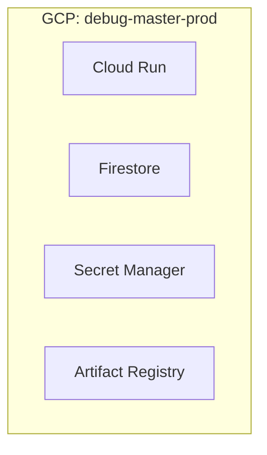
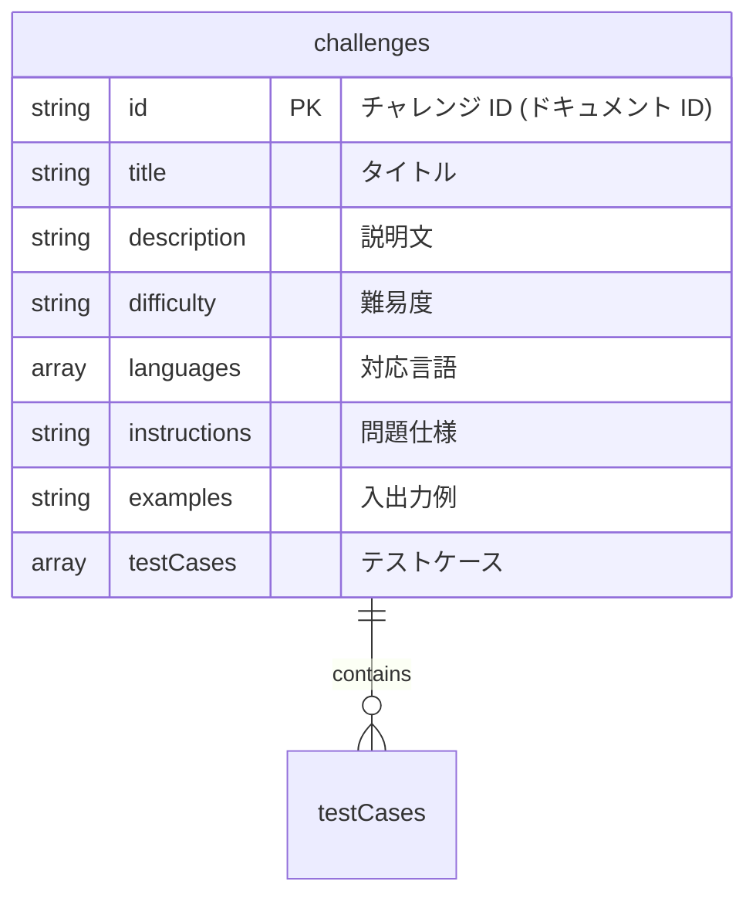
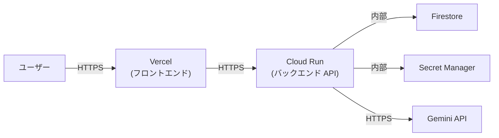

# インフラ構成

## 概要

Debug Master のクラウドインフラは Google Cloud Platform (GCP) と Vercel で構成される。バックエンド・DB・シークレット管理は GCP に、フロントエンドホスティングは Vercel に配置する。

## GCP リソース一覧

| サービス | 用途 |
|---|---|
| **Cloud Run** | FastAPI バックエンドの実行 |
| **Cloud Firestore** | チャレンジデータの永続化 |
| **Secret Manager** | API キー、認証情報等のシークレット管理 |
| **Artifact Registry** | Docker イメージの保存 |
| **Cloud Logging** | アプリケーションログの収集 |
| **Cloud Monitoring** | アラート・監視 |

## GCP プロジェクト構成

本番環境用の GCP プロジェクトを 1 つ作成する。ローカル開発は Docker Compose で行う。

| 環境 | GCP プロジェクト ID (例) | 用途 |
|---|---|---|
| prod | `debug-master-prod` | 本番用 |



### 環境変数

| 環境変数 | ローカル | prod |
|---|---|---|
| `ENVIRONMENT` | `local` | `prod` |
| `ALLOWED_ORIGINS` | `http://localhost:5173` | `https://debug-master.vercel.app` |
| `GEMINI_API_KEY` | `.env` ファイル | Secret Manager 経由 |

---

## Cloud Run 設定

### サービス構成

| 項目 | 値 |
|---|---|
| サービス名 | `debug-master-api` |
| リージョン | `asia-northeast1` (東京) |
| CPU | 1 |
| メモリ | 512 Mi |
| 最小インスタンス数 | 1 |
| 最大インスタンス数 | 10 |
| リクエストタイムアウト | 60 秒 |
| 同時実行数 | 80 |
| Ingress | すべてのトラフィック |

> コード実行 (`exec()`) はリクエスト内で行うため、タイムアウトには余裕を持たせる。個別のコード実行タイムアウトはアプリケーション側で 10 秒に制限する。

### サンドボックス (gVisor)

Cloud Run は第2世代実行環境でデフォルトで gVisor サンドボックスが有効。ユーザーコードの `exec()` 実行時にカーネルレベルでの隔離が提供される。

### Secret Manager マウント

Cloud Run のシークレットマウント機能で `GEMINI_API_KEY` を環境変数として注入する。

```yaml
# Cloud Run サービス設定 (参考)
spec:
  template:
    spec:
      containers:
        - image: REGION-docker.pkg.dev/PROJECT_ID/debug-master/api:latest
          env:
            - name: GEMINI_API_KEY
              valueFrom:
                secretKeyRef:
                  name: gemini-api-key
                  key: latest
            - name: ENVIRONMENT
              value: "prod"
            - name: ALLOWED_ORIGINS
              value: "https://debug-master.vercel.app"
```

### サービスアカウント

Cloud Run サービスに専用のサービスアカウントを割り当てる。

| サービスアカウント | IAM ロール | 目的 |
|---|---|---|
| `cloudrun-api@PROJECT_ID.iam.gserviceaccount.com` | `roles/datastore.user` | Firestore 読み書き |
| 同上 | `roles/secretmanager.secretAccessor` | Secret Manager 参照 |

---

## Firestore 設計

### データベース設定

| 項目 | 値 |
|---|---|
| データベースモード | Native モード |
| ロケーション | `asia-northeast1` (東京) |

### コレクション設計



#### `challenges` コレクション

現行の `challenges.json` と同じ構造。ドキュメント ID にはチャレンジの `id` フィールドを使用する。

```
challenges/
├── hello-world
│   ├── title: "はじめてのプログラム"
│   ├── description: "..."
│   ├── difficulty: "入門"
│   ├── languages: ["Python"]
│   ├── instructions: "..."
│   ├── examples: "..."
│   └── testCases: [{input: "太郎", expected: "こんにちは、太郎です！"}, ...]
├── age-calculator
│   └── ...
└── ...
```

> 認証はBasic 認証で行うため、`users` コレクションは不要。ユーザー管理は Secret Manager に格納した ID/パスワードで行う。

### Firestore インデックス

現時点では複合インデックスは不要。全件取得と ID 指定取得のみのため、デフォルトインデックスで十分。将来的に検索・フィルタ機能を追加する場合は、複合インデックスの設計が必要。

---

## Artifact Registry 設定

| 項目 | 値 |
|---|---|
| リポジトリ名 | `debug-master` |
| リージョン | `asia-northeast1` |
| 形式 | Docker |

イメージの命名規則:

```
asia-northeast1-docker.pkg.dev/{PROJECT_ID}/debug-master/api:{tag}
```

タグの運用:
- `latest`: 最新の main ブランチのビルド
- `{commit-sha}`: コミット SHA による特定バージョン

---

## Vercel 設定

### プロジェクト構成

| 項目 | 値 |
|---|---|
| フレームワーク | Vite |
| ルートディレクトリ | `frontend/` |
| ビルドコマンド | `npm run build` |
| 出力ディレクトリ | `dist` |

### 環境変数

| 環境変数 | 値 |
|---|---|
| `VITE_API_BASE_URL` | Cloud Run の URL |

### ドメイン設定

| 環境 | ドメイン |
|---|---|
| Production | `debug-master.vercel.app` (またはカスタムドメイン) |

### SPA リライトルール

React Router を使用しているため、すべてのルートを `index.html` にリライトする。Vercel はデフォルトで `vercel.json` なしでも Vite の SPA を正しく処理するが、明示的に設定する場合:

```json
{
  "rewrites": [
    { "source": "/(.*)", "destination": "/index.html" }
  ]
}
```

---

## ネットワーク構成



- すべての外部通信は HTTPS
- Cloud Run から Firestore / Secret Manager へのアクセスは GCP 内部ネットワーク経由
- Cloud Run の Ingress は「すべてのトラフィック」に設定 (Vercel からのリクエストを受け付けるため)
- CORS でオリジンを制限し、不正なドメインからのリクエストを拒否

---

## コスト見積もり (参考)

小規模な学習アプリとしての概算 (月額、無料枠適用後)。

| サービス | 無料枠 | 想定使用量 | 概算コスト |
|---|---|---|---|
| Cloud Run | 200 万リクエスト/月 | 小規模利用 | 無料枠内 |
| Firestore | 50K 読み取り/日、20K 書き込み/日 | 小規模利用 | 無料枠内 |
| Secret Manager | 6 アクティブバージョン | 1-2 シークレット | 無料枠内 |
| Artifact Registry | 0.5 GB まで無料 | Docker イメージ数個 | 無料枠内 |
| Vercel | Hobby プラン無料 | 小規模利用 | 無料 |
| **合計** | | | **ほぼ無料** |

> Gemini API のコストは別途。使用量に応じて課金される。

## 関連ドキュメント

- 新アーキテクチャ → [architecture.md](./architecture.md)
- CI/CD → [cicd.md](./cicd.md)
- セキュリティ設計 → [security.md](./security.md)
- DB 移行設計 → [database-migration.md](./database-migration.md)
