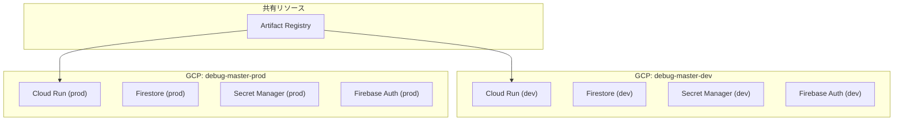
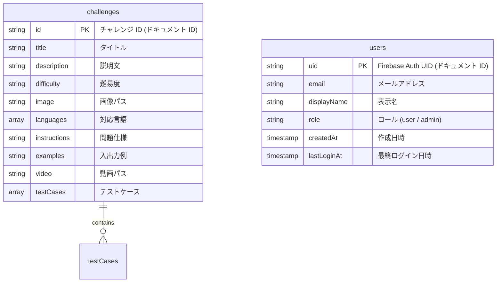
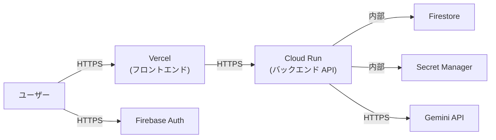

# インフラ構成

## 概要

Debug Master のクラウドインフラは Google Cloud Platform (GCP) と Vercel で構成される。バックエンド・DB・シークレット管理は GCP に、フロントエンドホスティングは Vercel に配置する。

## GCP リソース一覧

| サービス | 用途 | 環境 |
|---|---|---|
| **Cloud Run** | FastAPI バックエンドの実行 | dev / prod |
| **Cloud Firestore** | チャレンジデータ、ユーザーデータの永続化 | dev / prod |
| **Secret Manager** | API キー等のシークレット管理 | dev / prod |
| **Artifact Registry** | Docker イメージの保存 | 共有 |
| **Firebase Authentication** | Google SSO によるユーザー認証 | dev / prod |
| **Cloud Logging** | アプリケーションログの収集 | dev / prod |
| **Cloud Monitoring** | アラート・監視 | prod |

## 環境分離方針

### GCP プロジェクト構成

環境ごとに GCP プロジェクトを分離する。

| 環境 | GCP プロジェクト ID (例) | 用途 |
|---|---|---|
| dev | `debug-master-dev` | 開発・テスト用 |
| prod | `debug-master-prod` | 本番用 |



### 環境分離のメリット

- IAM 権限の完全な分離 (dev での事故が prod に影響しない)
- 課金の分離と可視化
- Firestore のセキュリティルールを環境ごとに管理可能

### 環境変数による切り替え

バックエンドでは `ENVIRONMENT` 環境変数で動作を制御する。

| 環境変数 | dev | prod |
|---|---|---|
| `ENVIRONMENT` | `dev` | `prod` |
| `ALLOWED_ORIGINS` | `http://localhost:5173,https://*.vercel.app` | `https://debug-master.vercel.app` |
| `GEMINI_API_KEY` | Secret Manager 経由 | Secret Manager 経由 |

---

## Cloud Run 設定

### サービス構成

| 項目 | dev | prod |
|---|---|---|
| サービス名 | `debug-master-api-dev` | `debug-master-api-prod` |
| リージョン | `asia-northeast1` (東京) | `asia-northeast1` (東京) |
| CPU | 1 | 1 |
| メモリ | 512 Mi | 512 Mi |
| 最小インスタンス数 | 0 | 1 |
| 最大インスタンス数 | 3 | 10 |
| リクエストタイムアウト | 60 秒 | 60 秒 |
| 同時実行数 | 80 | 80 |
| Ingress | すべてのトラフィック | すべてのトラフィック |

> コード実行 (`exec()`) はリクエスト内で行うため、タイムアウトには余裕を持たせる。個別のコード実行タイムアウトはアプリケーション側で 10 秒に制限する。

### サンドボックス (gVisor)

Cloud Run は第2世代実行環境でデフォルトで gVisor サンドボックスが有効。ユーザーコードの `exec()` 実行時にカーネルレベルでの隔離が提供される。

### Secret Manager マウント

Cloud Run のシークレットマウント機能で `GEMINI_API_KEY` を環境変数として注入する。

```yaml
# Cloud Run サービス設定 (参考)
spec:
  template:
    spec:
      containers:
        - image: REGION-docker.pkg.dev/PROJECT_ID/debug-master/api:latest
          env:
            - name: GEMINI_API_KEY
              valueFrom:
                secretKeyRef:
                  name: gemini-api-key
                  key: latest
            - name: ENVIRONMENT
              value: "prod"
            - name: ALLOWED_ORIGINS
              value: "https://debug-master.vercel.app"
```

### サービスアカウント

Cloud Run サービスに専用のサービスアカウントを割り当てる。

| サービスアカウント | IAM ロール | 目的 |
|---|---|---|
| `cloudrun-api@PROJECT_ID.iam.gserviceaccount.com` | `roles/datastore.user` | Firestore 読み書き |
| 同上 | `roles/secretmanager.secretAccessor` | Secret Manager 参照 |
| 同上 | `roles/firebase.sdkAdminServiceAgent` | Firebase Auth トークン検証 |

---

## Firestore 設計

### データベース設定

| 項目 | 値 |
|---|---|
| データベースモード | Native モード |
| ロケーション | `asia-northeast1` (東京) |

### コレクション設計



#### `challenges` コレクション

現行の `challenges.json` と同じ構造。ドキュメント ID にはチャレンジの `id` フィールドを使用する。

```
challenges/
├── hello-world
│   ├── title: "はじめてのプログラム"
│   ├── description: "..."
│   ├── difficulty: "入門"
│   ├── image: "images/character.png?..."
│   ├── languages: ["Python"]
│   ├── instructions: "..."
│   ├── examples: "..."
│   ├── video: "/videos/hello-world.mp4"
│   └── testCases: [{input: "太郎", expected: "こんにちは、太郎です！"}, ...]
├── age-calculator
│   └── ...
└── ...
```

#### `users` コレクション

Firebase Auth のユーザーに対応。初回ログイン時に自動作成する。

```
users/
├── {firebase-uid-1}
│   ├── email: "user@example.com"
│   ├── displayName: "ユーザー名"
│   ├── role: "user"
│   ├── createdAt: Timestamp
│   └── lastLoginAt: Timestamp
├── {firebase-uid-2}
│   ├── email: "admin@example.com"
│   ├── displayName: "管理者"
│   ├── role: "admin"
│   ├── createdAt: Timestamp
│   └── lastLoginAt: Timestamp
└── ...
```

> 管理者ロールの付与は、Firestore のコンソールまたは管理スクリプトで直接 `role` フィールドを `admin` に変更する。

### Firestore インデックス

現時点では複合インデックスは不要。全件取得と ID 指定取得のみのため、デフォルトインデックスで十分。将来的に検索・フィルタ機能を追加する場合は、複合インデックスの設計が必要。

---

## Artifact Registry 設定

| 項目 | 値 |
|---|---|
| リポジトリ名 | `debug-master` |
| リージョン | `asia-northeast1` |
| 形式 | Docker |

イメージの命名規則:

```
asia-northeast1-docker.pkg.dev/{PROJECT_ID}/debug-master/api:{tag}
```

タグの運用:
- `latest`: 最新の main ブランチのビルド
- `dev-{commit-sha}`: dev 環境向けビルド
- `prod-{commit-sha}`: prod 環境向けビルド

---

## Vercel 設定

### プロジェクト構成

| 項目 | 値 |
|---|---|
| フレームワーク | Vite |
| ルートディレクトリ | `frontend/` |
| ビルドコマンド | `npm run build` |
| 出力ディレクトリ | `dist` |

### 環境変数

| 環境変数 | Preview (dev) | Production (prod) |
|---|---|---|
| `VITE_API_BASE_URL` | Cloud Run dev の URL | Cloud Run prod の URL |
| `VITE_FIREBASE_API_KEY` | Firebase dev の API キー | Firebase prod の API キー |
| `VITE_FIREBASE_AUTH_DOMAIN` | `debug-master-dev.firebaseapp.com` | `debug-master-prod.firebaseapp.com` |
| `VITE_FIREBASE_PROJECT_ID` | `debug-master-dev` | `debug-master-prod` |

### ドメイン設定

| 環境 | ドメイン |
|---|---|
| Production | `debug-master.vercel.app` (またはカスタムドメイン) |
| Preview | `debug-master-{branch}-{hash}.vercel.app` (自動生成) |

### SPA リライトルール

React Router を使用しているため、すべてのルートを `index.html` にリライトする。Vercel はデフォルトで `vercel.json` なしでも Vite の SPA を正しく処理するが、明示的に設定する場合:

```json
{
  "rewrites": [
    { "source": "/(.*)", "destination": "/index.html" }
  ]
}
```

---

## ネットワーク構成



- すべての外部通信は HTTPS
- Cloud Run から Firestore / Secret Manager へのアクセスは GCP 内部ネットワーク経由
- Cloud Run の Ingress は「すべてのトラフィック」に設定 (Vercel からのリクエストを受け付けるため)
- CORS でオリジンを制限し、不正なドメインからのリクエストを拒否

---

## コスト見積もり (参考)

小規模な学習アプリとしての概算 (月額、無料枠適用後)。

| サービス | 無料枠 | 想定使用量 | 概算コスト |
|---|---|---|---|
| Cloud Run | 200 万リクエスト/月 | 小規模利用 | 無料枠内 |
| Firestore | 50K 読み取り/日、20K 書き込み/日 | 小規模利用 | 無料枠内 |
| Secret Manager | 6 アクティブバージョン | 1-2 シークレット | 無料枠内 |
| Artifact Registry | 0.5 GB まで無料 | Docker イメージ数個 | 無料枠内 |
| Firebase Auth | 50K MAU まで無料 | 小規模利用 | 無料枠内 |
| Vercel | Hobby プラン無料 | 小規模利用 | 無料 |
| **合計** | | | **ほぼ無料** |

> Gemini API のコストは別途。使用量に応じて課金される。

## 関連ドキュメント

- 新アーキテクチャ → [architecture.md](./architecture.md)
- CI/CD → [cicd.md](./cicd.md)
- セキュリティ設計 → [security.md](./security.md)
- DB 移行設計 → [database-migration.md](./database-migration.md)
