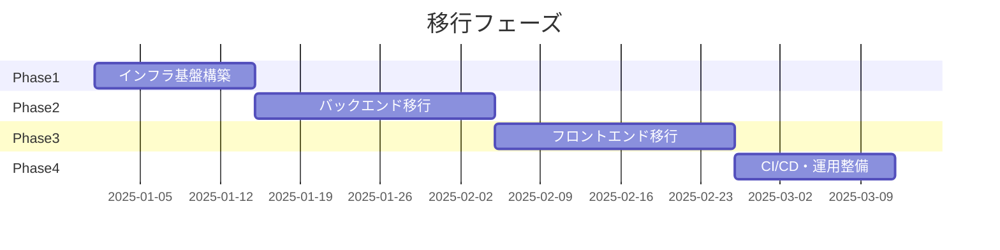
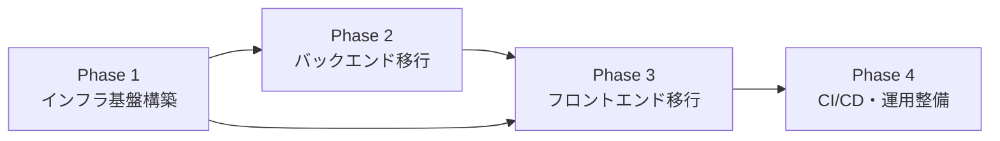

# 移行計画書

## 概要

Debug Master を Docker Compose によるローカル構成から、Google Cloud + Vercel によるクラウド構成へ移行する。移行は 4 つのフェーズに分割し、各フェーズ完了後に動作確認を行いながら段階的に進める。

## 移行フェーズ全体像

> 日付は仮置き。実際のスケジュールは着手時に決定する。

## フェーズ間の依存関係

- Phase 2 は Phase 1 の GCP プロジェクト・Firestore・Secret Manager が完了していることが前提
- Phase 3 は Phase 2 の Cloud Run デプロイが完了し、API エンドポイントが確定していることが前提
- Phase 3 の認証 UI は Phase 1 の Firebase Auth セットアップに依存
- Phase 4 は Phase 2, 3 が完了していることが前提だが、ワークフローの雛形作成は並行可能

---

## Phase 1: インフラ基盤構築

### 目的

GCP プロジェクトの作成と、全フェーズで利用する基盤サービスのセットアップを行う。

### タスク一覧

- [ ] GCP プロジェクト作成
- [ ] 課金アカウントの紐付けと予算アラートの設定
- [ ] 必要な API の有効化 (Cloud Run, Firestore, Secret Manager, Artifact Registry, Firebase)
- [ ] Firestore データベースの作成
  - [ ] `challenges` コレクションの設計確認
  - [ ] `users` コレクションの設計確認
  - [ ] セキュリティルールの初期設定
- [ ] Google Secret Manager のセットアップ
  - [ ] `GEMINI_API_KEY` の登録
- [ ] Firebase プロジェクトのセットアップ
  - [ ] Firebase Authentication の有効化
  - [ ] Google SSO プロバイダの設定
  - [ ] 承認済みドメインの追加 (Vercel ドメイン、localhost)
- [ ] Artifact Registry リポジトリの作成 (Docker イメージ用)
- [ ] サービスアカウントの作成と IAM ロール付与
  - [ ] Cloud Run 用サービスアカウント (Firestore 読み書き、Secret Manager アクセス)
  - [ ] GitHub Actions 用サービスアカウント (Cloud Run デプロイ、Artifact Registry プッシュ)
- [ ] `agents/` ディレクトリの削除

### 完了条件

- GCP プロジェクトが作成され、必要な API が有効化されている
- Firestore にアクセスでき、コレクション構造が確認できる
- Secret Manager に `GEMINI_API_KEY` が登録されている
- Firebase Auth で Google ログインのテストが成功する
- `agents/` ディレクトリが削除されている

---

## Phase 2: バックエンド移行

### 目的

FastAPI バックエンドを Cloud Run にデプロイし、データ永続化を JSON ファイルから Firestore に移行する。

### タスク一覧

- [ ] **データ層の移行**
  - [ ] `google-cloud-firestore` パッケージを `requirements.txt` に追加
  - [ ] `backend/database/challenge_repository.py` を Firestore クライアントに書き換え
    - [ ] `get_all_challenges()` → Firestore コレクション全件取得
    - [ ] `get_challenge_by_id(id)` → ドキュメント取得
    - [ ] `create_challenge(challenge)` → ドキュメント作成
    - [ ] `update_challenge(id, challenge)` → ドキュメント更新
    - [ ] `delete_challenge(id)` → ドキュメント削除
  - [ ] データ移行スクリプトの作成 (`challenges.json` → Firestore)
  - [ ] 移行スクリプトの実行
- [ ] **Secret Manager 統合**
  - [ ] `google-cloud-secret-manager` パッケージを `requirements.txt` に追加
  - [ ] `backend/config.py` を更新
    - [ ] ローカル: `.env` から読み取り (現行維持)
    - [ ] Cloud Run: Secret Manager からマウント or API 経由で取得
- [ ] **認証ミドルウェアの追加**
  - [ ] `firebase-admin` パッケージを `requirements.txt` に追加
  - [ ] Firebase Admin SDK の初期化処理を追加
  - [ ] JWT トークン検証ミドルウェアの実装
  - [ ] 管理者ロールチェック用のデコレータ/依存性注入の実装
  - [ ] 各エンドポイントへの認証適用
    - [ ] `GET /api/challenges`, `GET /api/challenges/{id}`: 認証済みユーザー
    - [ ] `POST /api/challenges`, `PUT /api/challenges/{id}`, `DELETE /api/challenges/{id}`: 管理者のみ
    - [ ] `POST /api/run-python`: 認証済みユーザー
    - [ ] `POST /api/generate-*`: 認証済みユーザー
    - [ ] `GET /api/health`: 認証不要
- [ ] **CORS 設定の更新**
  - [ ] `backend/app.py` の CORS `allow_origins` を環境変数ベースに変更
  - [ ] ローカル: `localhost:5173`
  - [ ] prod: 本番 Vercel ドメインのみ
- [ ] **コード実行のセキュリティ強化**
  - [ ] 実行タイムアウトの明示的な設定 (例: 10 秒)
  - [ ] 禁止文字列リストの拡張 (`import os`, `import subprocess` 等)
  - [ ] stdout/stderr のサイズ制限
- [ ] **Cloud Run デプロイ**
  - [ ] `backend/Dockerfile` の最適化 (マルチステージビルド等)
  - [ ] Cloud Run サービスの作成
  - [ ] Secret Manager シークレットのマウント設定
  - [ ] 環境変数の設定 (`ENVIRONMENT`, `ALLOWED_ORIGINS` 等)
  - [ ] 動作確認 (ヘルスチェック、CRUD、コード実行、AI 生成)
- [ ] **Agents 関連のクリーンアップ**
  - [ ] `docs/agents.md` の削除

### 完了条件

- Cloud Run 上で FastAPI が稼働し、`/api/health` が応答する
- Firestore 経由でチャレンジの CRUD が動作する
- Firebase Auth トークンなしのリクエストが 401 で拒否される
- 管理者以外のユーザーによる POST/PUT/DELETE が 403 で拒否される
- コード実行がタイムアウト付きで正常に動作する
- Gemini API キーが Secret Manager 経由で取得できている

---

## Phase 3: フロントエンド移行

### 目的

フロントエンドを Vercel にデプロイし、Firebase Authentication による Google ログインと管理者画面を追加する。

### タスク一覧

- [ ] **API 接続先の切り替え**
  - [ ] `frontend/src/config/api.ts` を更新
    - [ ] `VITE_API_BASE_URL` 環境変数で Cloud Run の URL を設定
  - [ ] API クライアントに認証トークン付与を追加
    - [ ] `frontend/src/services/` 配下のリクエストに `Authorization: Bearer <token>` ヘッダーを追加
- [ ] **Firebase Auth の統合**
  - [ ] `firebase` パッケージを `package.json` に追加
  - [ ] Firebase 設定ファイルの作成 (`frontend/src/config/firebase.ts`)
  - [ ] 認証コンテキストの作成 (`frontend/src/contexts/AuthContext.tsx`)
    - [ ] Google ログイン/ログアウト機能
    - [ ] 認証状態の管理
    - [ ] トークンの自動更新
  - [ ] ログイン画面の作成 (`frontend/src/components/LoginPage.tsx`)
  - [ ] 認証ガード (PrivateRoute) の実装
  - [ ] ヘッダーにユーザー情報とログアウトボタンを追加
- [ ] **管理者画面の追加**
  - [ ] 管理者ルート (`/admin`) の追加 (`App.tsx`)
  - [ ] 管理者専用ガード (AdminRoute) の実装
  - [ ] チャレンジ管理画面の作成
    - [ ] チャレンジ一覧 (テーブル表示)
    - [ ] チャレンジ作成フォーム
    - [ ] チャレンジ編集フォーム
    - [ ] チャレンジ削除 (確認付き)
- [ ] **静的データの整理**
  - [ ] `frontend/src/challengesData.ts` を API 経由に統合するか検討
    - [ ] ThemeSelection コンポーネントを API 経由のデータ取得に変更
- [ ] **image / video フィールドの廃止と UI 変更**
  - [ ] `Challenge` 型から `image` / `video` フィールドを削除
  - [ ] バックエンドのデータモデルから `image` / `video` を削除
  - [ ] ThemeSelection (問題一覧画面) のUI変更 (サムネイル廃止に伴うレイアウト変更)
  - [ ] VideoModal コンポーネントの削除
  - [ ] ChallengeEditor から動画関連UIを削除
  - [ ] キャラクター画像等の静的アセットをソースコードに含める
- [ ] **Vercel デプロイ**
  - [ ] Vercel プロジェクトの作成
  - [ ] GitHub リポジトリとの連携
  - [ ] 環境変数の設定
    - [ ] `VITE_API_BASE_URL` (Cloud Run の URL)
    - [ ] `VITE_FIREBASE_*` (Firebase 設定値)
  - [ ] ビルド設定の確認 (`npm run build`)
  - [ ] プレビューデプロイの確認
  - [ ] 本番デプロイの確認
- [ ] **動作確認**
  - [ ] Google ログインフロー
  - [ ] 一般ユーザーでのチャレンジ利用
  - [ ] 管理者でのチャレンジ CRUD
  - [ ] コード実行とテスト結果表示
  - [ ] AI コード生成、ヒント生成、解説生成

### 完了条件

- Vercel 上でフロントエンドが稼働している
- Google ログインでアクセスできる
- 管理者ユーザーがチャレンジの作成・編集・削除を行える
- 一般ユーザーがチャレンジを選択し、コードを修正・実行・テストできる
- AI 連携 (コード生成、ヒント、解説) が正常に動作する

---

## Phase 4: CI/CD・運用整備

### 目的

GitHub Actions による自動デプロイパイプラインを構築し、運用に必要な監視・ログ設定を行う。

### タスク一覧

- [ ] **GitHub Actions ワークフローの作成**
  - [ ] バックエンドデプロイワークフロー (`.github/workflows/deploy-backend.yml`)
    - [ ] Docker ビルド → Artifact Registry プッシュ → Cloud Run デプロイ
    - [ ] main ブランチへのマージ時に prod 環境へデプロイ
  - [ ] フロントエンドデプロイ (Vercel GitHub 連携で自動化)
    - [ ] PR: プレビューデプロイ
    - [ ] main マージ: 本番デプロイ
  - [ ] テスト・リントワークフロー (`.github/workflows/test.yml`)
    - [ ] フロントエンド: `npm run lint`, `npm run build`
    - [ ] バックエンド: `ruff check`, `pytest` (テストがあれば)
- [ ] **GitHub Secrets の設定**
  - [ ] `GCP_PROJECT_ID`
  - [ ] `GCP_WORKLOAD_IDENTITY_PROVIDER`
  - [ ] `GCP_SA_EMAIL`
  - [ ] `GCP_REGION`
- [ ] **監視・ログ**
  - [ ] Cloud Run のログを Cloud Logging で確認できることを確認
  - [ ] Cloud Run のエラーアラート設定 (Cloud Monitoring)
  - [ ] Vercel のデプロイ通知 (Slack 等、必要に応じて)
- [ ] **ドキュメント更新**
  - [ ] ルートの `README.md` をクラウド構成に合わせて更新
  - [ ] `docs/setup.md` にクラウド環境のセットアップ手順を追記
  - [ ] Docker Compose 関連の記述をローカル開発用として整理
- [ ] **クリーンアップ**
  - [ ] 不要になったファイルの確認と削除
  - [ ] `compose.yml` をローカル開発専用に整理
  - [ ] `.gitignore` の更新

### 完了条件

- main ブランチへのマージで自動的にフロントエンド・バックエンドがデプロイされる
- PR 作成時にプレビュー環境にデプロイされる (Vercel)
- Cloud Logging でバックエンドのログが確認できる
- README が新しいクラウド構成を反映している

---

## リスクと注意点

| リスク | 影響 | 対策 |
|---|---|---|
| `exec()` によるコード実行のセキュリティ | クラウド環境での任意コード実行は重大なリスク | Cloud Run の gVisor サンドボックス、タイムアウト、禁止文字列拡張で緩和 |
| Firestore の読み書きコスト | リクエスト数に応じた課金 | 無料枠 (50K 読み取り/日) の範囲で運用。キャッシュ戦略を検討 |
| Cloud Run のコールドスタート | 初回リクエストの遅延 | 最小インスタンス数を 1 に設定 (コストとのトレードオフ) |
| Gemini API の利用制限 | レート制限やクォータ超過 | 既存のフォールバック機構を維持。エラーハンドリングの強化 |
| CORS 設定ミス | フロントエンドからの API 呼び出し失敗 | 環境変数で管理し、デプロイ後にテスト |

## 関連ドキュメント

- 新アーキテクチャ → [architecture.md](./architecture.md)
- インフラ構成 → [infrastructure.md](./infrastructure.md)
- CI/CD → [cicd.md](./cicd.md)
- セキュリティ → [security.md](./security.md)
- DB 移行 → [database-migration.md](./database-migration.md)
- 現行仕様 → [../docs/](../docs/)
