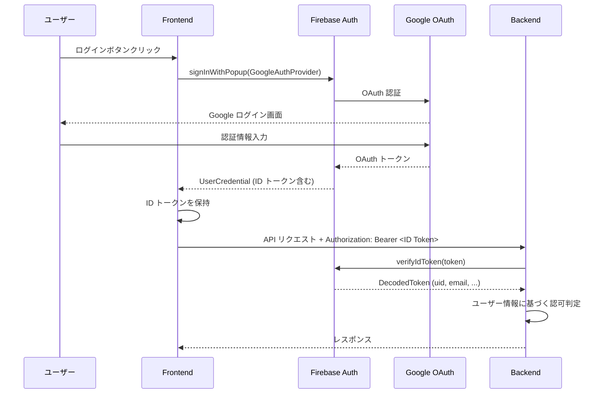
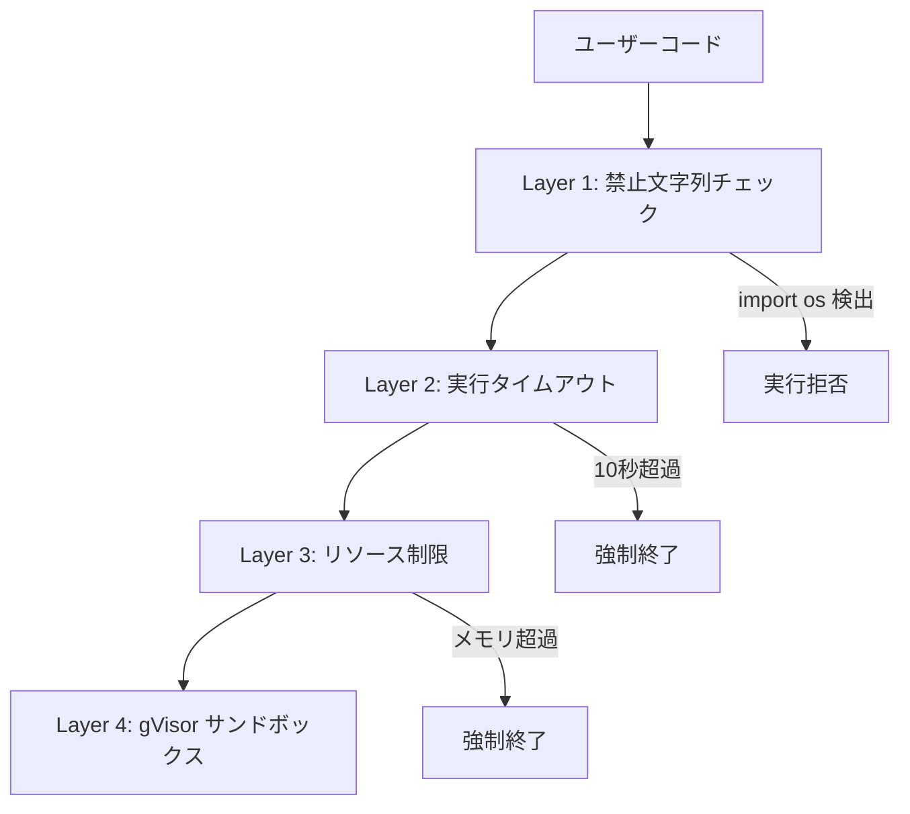

# セキュリティ設計

## 概要

Debug Master のクラウド化にあたり、以下の 5 つのセキュリティ領域を設計する。

1. **認証・認可** - Firebase Authentication (Google SSO) + 管理者ロール
2. **シークレット管理** - Google Secret Manager
3. **コード実行のサンドボックス** - Cloud Run gVisor + アプリケーションレベルの制限
4. **通信セキュリティ** - HTTPS + CORS 制限
5. **データアクセス制御** - Firestore セキュリティルール

---

## 1. 認証・認可

### 認証方式: Firebase Authentication (Google SSO)



### ユーザーロール

| ロール | 説明 | 権限 |
|---|---|---|
| `user` | 一般ユーザー | チャレンジの閲覧・実行、コード実行、AI 機能の利用 |
| `admin` | 管理者 | 上記 + チャレンジの作成・編集・削除 |

ロール情報は Firestore の `users` コレクションで管理する。

```
users/{uid}
├── email: "user@example.com"
├── displayName: "ユーザー名"
├── role: "user" | "admin"
├── createdAt: Timestamp
└── lastLoginAt: Timestamp
```

### 初回ログイン時のユーザー登録

初回 Google ログイン時に、バックエンドまたはフロントエンドで `users` コレクションにドキュメントを自動作成する。デフォルトロールは `user`。

```python
# バックエンド側: 認証ミドルウェア内での処理イメージ
async def get_or_create_user(uid: str, email: str, display_name: str):
    user_ref = db.collection("users").document(uid)
    user_doc = user_ref.get()
    if not user_doc.exists:
        user_ref.set({
            "email": email,
            "displayName": display_name,
            "role": "user",
            "createdAt": firestore.SERVER_TIMESTAMP,
            "lastLoginAt": firestore.SERVER_TIMESTAMP,
        })
    else:
        user_ref.update({"lastLoginAt": firestore.SERVER_TIMESTAMP})
    return user_ref.get().to_dict()
```

### 管理者ロールの付与

管理者の付与は以下のいずれかの方法で行う (初期段階では手動で十分)。

1. **Firestore コンソール**: ドキュメントの `role` フィールドを `admin` に直接変更
2. **管理スクリプト**: CLI ツールでロールを変更

```python
# 管理スクリプト例: scripts/set_admin.py
from google.cloud import firestore

def set_admin(uid: str):
    db = firestore.Client()
    db.collection("users").document(uid).update({"role": "admin"})
    print(f"User {uid} is now admin")
```

### API エンドポイントの認可マトリクス

| エンドポイント | 未認証 | user | admin |
|---|---|---|---|
| `GET /api/health` | OK | OK | OK |
| `GET /api/challenges` | 401 | OK | OK |
| `GET /api/challenges/{id}` | 401 | OK | OK |
| `POST /api/challenges` | 401 | 403 | OK |
| `PUT /api/challenges/{id}` | 401 | 403 | OK |
| `DELETE /api/challenges/{id}` | 401 | 403 | OK |
| `POST /api/run-python` | 401 | OK | OK |
| `POST /api/generate-code` | 401 | OK | OK |
| `POST /api/generate-hint` | 401 | OK | OK |
| `POST /api/generate-explanation` | 401 | OK | OK |
| `POST /api/generate-retire-explanation` | 401 | OK | OK |

### FastAPI 認証ミドルウェアの実装方針

```python
# backend/middleware/auth.py (実装方針)
import firebase_admin
from firebase_admin import auth as firebase_auth
from fastapi import Request, HTTPException, Depends

# Firebase Admin SDK 初期化
firebase_admin.initialize_app()

async def verify_token(request: Request) -> dict:
    """Bearer トークンを検証し、ユーザー情報を返す"""
    auth_header = request.headers.get("Authorization")
    if not auth_header or not auth_header.startswith("Bearer "):
        raise HTTPException(status_code=401, detail="Missing or invalid token")

    token = auth_header.split("Bearer ")[1]
    try:
        decoded = firebase_auth.verify_id_token(token)
        return decoded
    except Exception:
        raise HTTPException(status_code=401, detail="Invalid token")

async def require_admin(user: dict = Depends(verify_token)) -> dict:
    """管理者ロールを要求する"""
    uid = user["uid"]
    user_doc = db.collection("users").document(uid).get()
    if not user_doc.exists or user_doc.to_dict().get("role") != "admin":
        raise HTTPException(status_code=403, detail="Admin access required")
    return user
```

### フロントエンドの認証コンテキスト

```typescript
// frontend/src/contexts/AuthContext.tsx (実装方針)
interface AuthContextType {
  user: User | null;
  loading: boolean;
  isAdmin: boolean;
  signInWithGoogle: () => Promise<void>;
  signOut: () => Promise<void>;
  getIdToken: () => Promise<string | null>;
}
```

API クライアントでは `getIdToken()` を使い、リクエストヘッダーにトークンを付与する。

```typescript
// frontend/src/services/api.ts (実装方針)
const apiClient = async (endpoint: string, options: RequestInit = {}) => {
  const token = await getIdToken();
  return fetch(`${API_BASE_URL}${endpoint}`, {
    ...options,
    headers: {
      ...options.headers,
      'Content-Type': 'application/json',
      ...(token ? { Authorization: `Bearer ${token}` } : {}),
    },
  });
};
```

---

## 2. シークレット管理

### 現行の課題

- `GEMINI_API_KEY` を `.env` ファイルで管理
- `.env` は `.gitignore` に含まれているが、ローカルファイルでの管理はセキュリティリスク
- クラウド環境では環境変数にハードコードするのは不適切

### 移行後: Google Secret Manager

| シークレット名 | 説明 | 利用サービス |
|---|---|---|
| `gemini-api-key` | Gemini API キー | Cloud Run (バックエンド) |

### アクセス方式

Cloud Run ではシークレットを環境変数としてマウントする。アプリケーションコードからは通常の環境変数として読み取れるため、最小限のコード変更で済む。

```python
# backend/config.py の変更方針
import os

# Cloud Run ではSecret Manager から環境変数として注入される
# ローカル開発では .env から読み取る (python-dotenv)
GEMINI_API_KEY = os.getenv("GEMINI_API_KEY")
```

### ローカル開発との切り替え

| 環境 | 取得方法 |
|---|---|
| ローカル | `.env` ファイル + `python-dotenv` |
| Cloud Run | Secret Manager → 環境変数マウント |

`config.py` のロジックは変更不要。`os.getenv()` で統一的に取得できる。

### シークレットのローテーション

Secret Manager の新しいバージョンを作成し、Cloud Run サービスを再デプロイすることでローテーション可能。

---

## 3. コード実行のサンドボックス

### 現行の課題

ユーザーコードを `exec()` で直接実行しており、以下のリスクがある。

- ファイルシステムへのアクセス
- ネットワークへのアクセス
- 環境変数の読み取り (API キー漏洩)
- 無限ループによるリソース消費
- `os`, `subprocess` 等を使った任意コマンド実行

### 多層防御戦略



### Layer 1: アプリケーションレベルの禁止文字列チェック

現行の `GEMINI_API_KEY` チェックを拡張する。

```python
# backend/code_runner.py の拡張方針
FORBIDDEN_PATTERNS = [
    "GEMINI_API_KEY",
    "import os",
    "import subprocess",
    "import sys",
    "import shutil",
    "import socket",
    "import http",
    "import urllib",
    "import requests",
    "__import__",
    "eval(",
    "exec(",
    "open(",
    "compile(",
    "globals(",
    "locals(",
    "getattr(",
    "setattr(",
    "delattr(",
    "breakpoint(",
]
```

> `exec()` 自体はコード実行エンジンが使用するため、ユーザーコード内での使用のみを禁止する。

### Layer 2: 実行タイムアウト

```python
import signal

def run_with_timeout(code: str, timeout_seconds: int = 10):
    def handler(signum, frame):
        raise TimeoutError("Code execution timed out")

    signal.signal(signal.SIGALRM, handler)
    signal.alarm(timeout_seconds)
    try:
        exec(code, {"__builtins__": safe_builtins})
    finally:
        signal.alarm(0)
```

### Layer 3: リソース制限

- stdout のキャプチャサイズを制限 (例: 1MB)
- Cloud Run のコンテナメモリ制限 (512Mi) が自然な上限として機能

### Layer 4: Cloud Run gVisor サンドボックス

Cloud Run の第 2 世代実行環境では gVisor が自動的に有効。カーネルシステムコールレベルでの隔離が提供される。

- ファイルシステムはコンテナ内に限定
- ネットワークアクセスはコンテナのネットワーク設定に従う
- プロセスの隔離が保証される

### 制限付きビルトイン

`exec()` の実行環境から危険なビルトインを除外する。

```python
import builtins

ALLOWED_BUILTINS = {
    'print', 'range', 'len', 'int', 'float', 'str', 'bool',
    'list', 'dict', 'tuple', 'set', 'sorted', 'reversed',
    'enumerate', 'zip', 'map', 'filter', 'sum', 'min', 'max',
    'abs', 'round', 'pow', 'divmod', 'isinstance', 'type',
    'input', 'True', 'False', 'None',
}

safe_builtins = {
    name: getattr(builtins, name)
    for name in ALLOWED_BUILTINS
    if hasattr(builtins, name)
}
```

---

## 4. 通信セキュリティ

### HTTPS

- Vercel: デフォルトで HTTPS
- Cloud Run: デフォルトで HTTPS (Google 管理の証明書)
- すべての通信は HTTPS で行われる

### CORS 設定

現行の `allow_origins=["*"]` を、環境に応じた特定ドメインのみに制限する。

```python
# backend/app.py の変更方針
import os

ALLOWED_ORIGINS = os.getenv("ALLOWED_ORIGINS", "http://localhost:5173").split(",")

app.add_middleware(
    CORSMiddleware,
    allow_origins=ALLOWED_ORIGINS,
    allow_credentials=True,
    allow_methods=["GET", "POST", "PUT", "DELETE", "OPTIONS"],
    allow_headers=["Authorization", "Content-Type"],
)
```

| 環境 | `ALLOWED_ORIGINS` |
|---|---|
| ローカル | `http://localhost:5173` |
| prod | `https://debug-master.vercel.app` |

### レート制限

初期段階ではレート制限は設けないが、将来的に以下を検討する。

- Cloud Run の最大同時実行数による自然な制限
- API Gateway やミドルウェアによるリクエストレート制限
- 特にコード実行 (`/api/run-python`) と AI 生成エンドポイントに対する制限

---

## 5. Firestore セキュリティルール

Firestore のセキュリティルールは、バックエンドが Admin SDK でアクセスするため、基本的にバックエンド経由のアクセスのみを許可する。フロントエンドから直接 Firestore にアクセスすることは想定しない。

```
rules_version = '2';
service cloud.firestore {
  match /databases/{database}/documents {
    // デフォルト: すべて拒否
    match /{document=**} {
      allow read, write: if false;
    }
  }
}
```

> バックエンドは Firebase Admin SDK を使用するため、セキュリティルールをバイパスする。このルールはフロントエンドからの直接アクセスを完全にブロックする目的で設定する。

---

## セキュリティチェックリスト

### デプロイ前

- [ ] Firebase Auth の承認済みドメインに Vercel ドメインを追加
- [ ] Secret Manager に `GEMINI_API_KEY` を登録
- [ ] Cloud Run の環境変数 `ALLOWED_ORIGINS` を正しく設定
- [ ] Firestore セキュリティルールをデプロイ
- [ ] サービスアカウントの IAM ロールが最小権限であることを確認
- [ ] `backend/.env` が `.gitignore` に含まれていることを確認

### 定期確認

- [ ] Firebase Auth の不審なログインアクティビティ
- [ ] Cloud Run のエラーログ
- [ ] Secret Manager のアクセスログ
- [ ] Firestore のアクセスパターン
- [ ] 想定外の課金増加

## 関連ドキュメント

- 新アーキテクチャ → [architecture.md](./architecture.md)
- インフラ構成 → [infrastructure.md](./infrastructure.md)
- CI/CD → [cicd.md](./cicd.md)
- DB 移行設計 → [database-migration.md](./database-migration.md)
