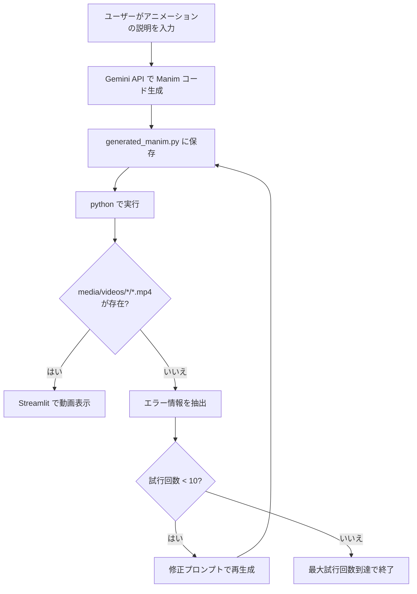

# Agents モジュール (Manim アニメーション生成)

## 概要

`agents/` ディレクトリには、**Streamlit + Manim** を使ったアニメーション生成ツールが含まれています。自然言語でアニメーションの内容を記述すると、Gemini API が Manim のコードを生成し、自動的に実行して動画を作成します。

> このモジュールはメインの Debug Master アプリとは**独立**しており、`compose.yml` には含まれていません。

## 技術スタック

| 技術 | バージョン | 用途 |
|---|---|---|
| Streamlit | 1.43.2 | Web UI |
| Google Gemini API | google-genai 1.5.0 | コード生成 |
| Manim | 0.19.0 | アニメーション作成 |
| Python | 3.12 | 実行環境 |

## 動作フロー



## 主な機能

### アニメーション生成

1. ユーザーが Streamlit のテキストエリアにアニメーションの説明を入力
2. Gemini API (`gemini-3.0-flash`) に Manim コードの生成を依頼
3. 生成されたコードを `generated_manim.py` に書き出し
4. `python generated_manim.py` で実行
5. `media/videos/` 配下に `.mp4` が生成されれば成功

### 自動リトライ機構

- 最大 **10 回** まで自動リトライ
- JSON デコードエラーは最大 **3 回** リトライ
- 失敗時はエラー情報を抽出し、修正用プロンプト (`MODIFY_SYSTEM_INSTRUCTION`) で再生成
- 実行前に `media/` フォルダをクリーンアップ

### システムプロンプト

**初回生成** (`SYSTEM_INSTRUCTION`):
- アニメーションで問題を視覚的に説明
- テキストは最小限に、コード表示はしない
- LaTeX は使用しない
- JSON 形式 (`{"code": "..."}`) で出力

**修正時** (`MODIFY_SYSTEM_INSTRUCTION`):
- エラーを修正するコードを生成
- LaTeX 関連のエラーなら LaTeX を使用しない修正を行う

## セットアップ

### Docker でのビルドと実行

```bash
cd agents

# Docker イメージのビルド
make build
# (= docker build -t manim-agent .)

# コンテナの起動 (対話的シェル)
make run
# (= docker run -it --rm -v ${PWD}:/workspace -p 8501:8501 --name manim-agent bash)

# コンテナ内で Streamlit を起動
streamlit run app.py
```

http://localhost:8501 にアクセスして使用します。

### Dockerfile の構成

- ベースイメージ: `ghcr.io/astral-sh/uv:python3.12-bookworm-slim`
- Manim に必要なシステムパッケージ: `build-essential`, `libcairo2-dev`, `libpango1.0-dev` など
- Python 依存関係は `uv pip install` でインストール

### 環境変数

Agents モジュールも `GEMINI_API_KEY` が必要です。コンテナ内で設定するか、`.env` ファイルを用意してください。

## ファイル構成

```
agents/
├── app.py              # Streamlit アプリケーション本体
├── Dockerfile          # Docker ビルド定義
├── Makefile            # build / run コマンド
└── requirements.txt    # Python 依存関係
```

## 関連ドキュメント

- メインアプリのセットアップ → [setup.md](./setup.md)
- 全体アーキテクチャ → [architecture.md](./architecture.md)
