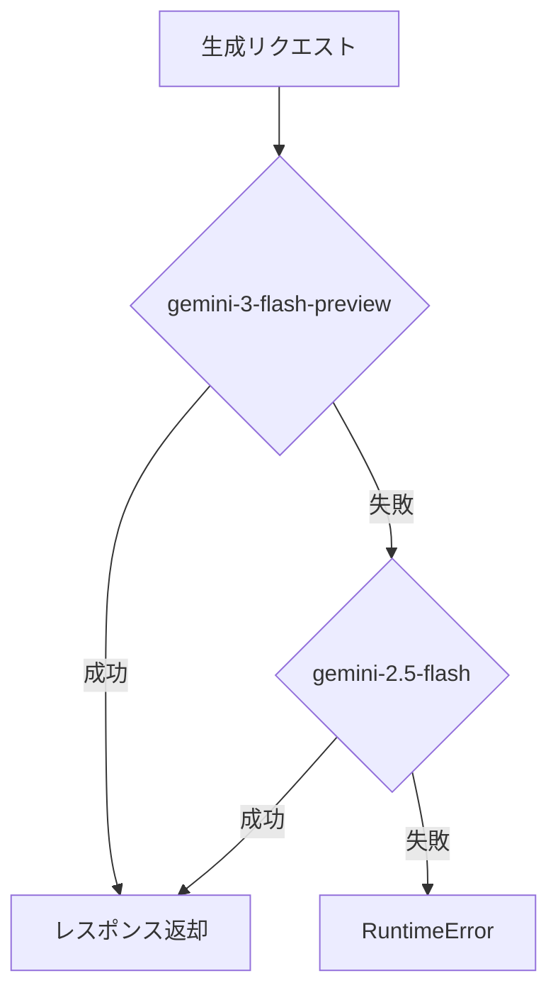
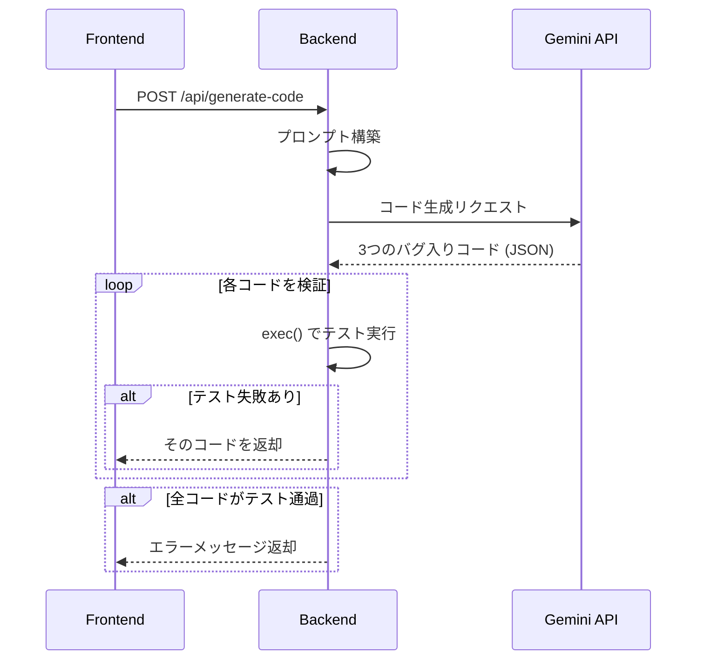

# AI 連携 (Gemini API)

## 概要

Debug Master では Google Gemini API を 4 つの機能で活用しています。

1. **バグ入りコード生成** - 意図的にバグを含むコードを生成
2. **ヒント生成** - 4 段階の段階的ヒント
3. **成功時解説** - 修正前後の差分に基づく解説
4. **リタイア時解説** - 正解コードと励ましのフィードバック

## 接続設定

ファイル: `backend/config.py`, `backend/gemini_utils.py`

| 設定項目 | 値 |
|---|---|
| API キー | `GEMINI_API_KEY` 環境変数 |
| モデル候補 | `gemini-3-flash-preview`, `gemini-2.5-flash` |
| Temperature | `1.0` |
| レスポンス形式 | `application/json` |

### フォールバック機構

`_generate_content_with_fallback()` 関数が、`GEMINI_MODEL_CANDIDATES` に定義されたモデルを順番に試行します。最初のモデルが失敗した場合、次のモデルに自動的にフォールバックします。



### JSON パース戦略

Gemini API のレスポンスから JSON を抽出する際、複数のフォールバック戦略を使います。

1. レスポンス全体を `json.loads()` で直接パース
2. Markdown コードブロック (` ```json ... ``` `) 内の JSON を抽出
3. `{...}` パターンで JSON オブジェクトを正規表現で抽出
4. `[...]` パターンで JSON 配列を正規表現で抽出

---

## 1. バグ入りコード生成

### 処理フロー



### システムプロンプトの概要

`SYSTEM_INSTRUCTION` (config.py) には、AI がバグを生成する際の指針が含まれます。

**バグパターンの分類** (参考文献に基づく):

| パターン | 説明 |
|---|---|
| Misinterpretation | プロンプトの意図から逸脱 |
| Syntax Error | 構文エラー（括弧やセミコロンの欠落） |
| Silly Mistake | 冗長な条件や不要なキャスト |
| Prompt-biased code | 例に過度に依存したコード |
| Missing Corner Case | 特定のコーナーケースでの失敗 |
| Wrong Input Type | 入力型の誤り |
| Hallucinated Object | 存在しないオブジェクトの参照 |
| Wrong Attribute | 誤った属性の参照 |
| Incomplete Generation | 不完全なコード生成 |
| Non-Prompted Consideration | プロンプト外の処理の混入 |

### コード生成ルール

- 3 つのバグ入りコードを生成（`code`, `fixed_code`, `explanation` のセット）
- テストケース入力をコードに埋め込み、順番に処理
- `---- テストケース{i} ----` マーカーを必ず出力に含める
- バグの説明コメントはコード内に含めない
- `explanation` は日本語で記述

### コードテンプレート

生成コードには以下のテンプレートが必ず含まれます。

```python
##### 編集禁止 ######
test_cases = [テストケース入力一覧]

for i, input_value in enumerate(test_cases, start=1):
    print(f"---- テストケース{i} ----")
##### 編集禁止 ######
    #### ここから編集
    pass
```

---

## 2. ヒント生成

### 処理フロー

学生のコード、問題の仕様、テスト結果を入力として、4 段階のヒントを生成します。

### ヒントレベル

| レベル | 目的 | 例 |
|---|---|---|
| 1. 方向性 | 解決への方向やポイントを短く提示 | 「出力の末尾に注目しましょう」 |
| 2. キーワード | 具体的なキーワードやアプローチ名 | 「句読点の種類を確認しましょう」 |
| 3. 骨子 | 解法の大まかな手順や疑似コード | 「文字列の最後の文字を確認する処理を追加」 |
| 4. 最終ヒント | ほぼ答えに近い具体的な対処法 | 「"。"を"！"に変更してください」 |

### システムプロンプトの概要

`HINT_SYSTEM_INSTRUCTION` はプログラミングチューターの役割を定義し、以下を求めます。

- 完全な答えは提供しない
- 問題のある箇所を特定する方向性を示す
- 関連する概念を必要に応じて説明
- 励ましのトーン
- 日本語で回答

### ヒント内容の正規化

`_normalize_hint_content()` 関数が、ヒントテキスト内のコードブロックやインラインコードを正規化します。

- トリプルバッククォートのコードブロック → 保持・整形
- シングルバッククォートのインラインコード → ダブルバッククォートに変換

---

## 3. 成功時解説

### 入出力

修正前コード (before) と修正後コード (after) を比較し、以下の JSON を返します。

```json
{
  "reason": "修正理由: どこがバグで、なぜ修正が必要だったか",
  "explain_diff": "変更点の要点（箇条書き）"
}
```

### システムプロンプトの概要

`EXPLANATION_SYSTEM_INSTRUCTION` は以下を求めます。

- 日本語での構造的・教育的な解説
- 具体的なバグ箇所の特定
- 変更点を箇条書きで簡潔に説明
- Markdown フェンスや JSON 外のテキストを含めない

---

## 4. リタイア時解説

### 入出力

学習者がリタイアした際に、正解コードと励ましのフィードバックを生成します。

```json
{
  "answer_code": "正しく修正されたコード",
  "explanation": "やさしく短い解説",
  "advice": "学習者への励ましとアドバイス"
}
```

### システムプロンプトの概要

`RETIRE_SYSTEM_INSTRUCTION` は「やさしく寄り添うプログラミングの先生」として振る舞い、以下を求めます。

- 日本語で、やさしく励ますトーン
- 短くシンプルな言葉（専門用語は避ける）
- AI 生成コードと学習者コードが同一なら「手を付けられていない」と判断
- エラーの「どこで・なぜ」を具体的に説明
- 次にどう行動すればよいかを実践的に提示

---

## 関連ドキュメント

- API エンドポイント → [api-reference.md](./api-reference.md)
- バックエンドの実装 → [backend.md](./backend.md)
- 全体アーキテクチャ → [architecture.md](./architecture.md)
