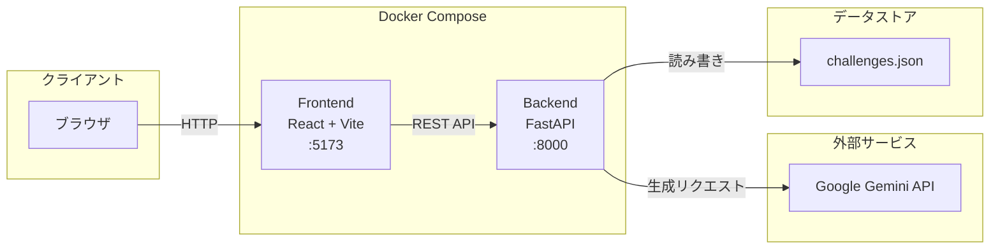
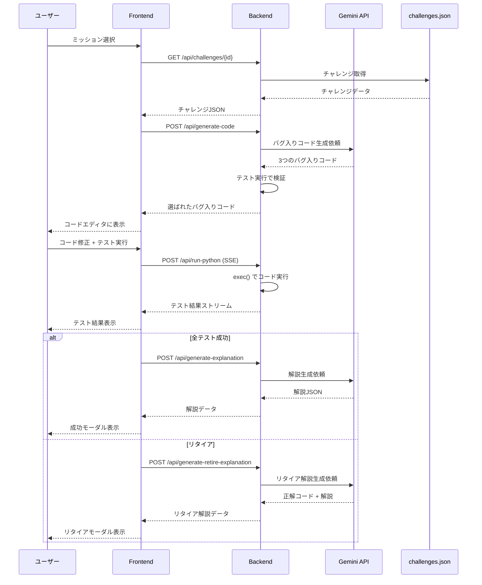
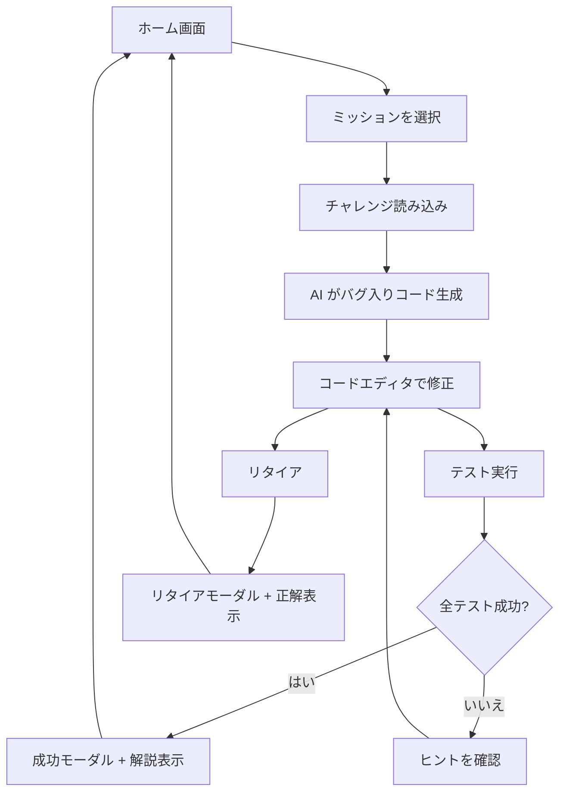

# 全体アーキテクチャ

## 技術スタック

| レイヤー | 技術 | バージョン |
|---|---|---|
| **フロントエンド** | React + TypeScript | React 18, TypeScript 5.5 |
| **ビルドツール** | Vite | 5.4 |
| **スタイリング** | Tailwind CSS + PostCSS | Tailwind 3.4 |
| **コードエディタ** | CodeMirror 6 (@uiw/react-codemirror) | 4.23 |
| **バックエンド** | Python + FastAPI | Python 3.13, FastAPI 0.116 |
| **AI** | Google Gemini API (google-genai) | 1.36 |
| **データベース** | JSON ファイル | - |
| **デプロイ** | Docker Compose | - |

## サービス構成



## データフロー



## ユーザーフロー



## ディレクトリ構成

```
debug-master/
├── frontend/                  # React フロントエンド
│   ├── src/
│   │   ├── components/        # React コンポーネント
│   │   ├── config/            # API エンドポイント設定
│   │   ├── hooks/             # カスタムフック
│   │   ├── services/          # API クライアント
│   │   ├── types/             # TypeScript 型定義
│   │   ├── App.tsx            # ルーティング定義
│   │   ├── ChallengeEditor.tsx # メインのチャレンジ画面
│   │   ├── challengesData.ts  # 静的チャレンジデータ
│   │   ├── main.tsx           # エントリーポイント
│   │   └── index.css          # グローバルスタイル
│   ├── public/images/                # 画像アセット
│   ├── videos/                # 動画アセット
│   ├── Dockerfile
│   ├── package.json
│   ├── vite.config.ts
│   └── tailwind.config.js
│
├── backend/                   # FastAPI バックエンド
│   ├── api/
│   │   └── challenges.py      # チャレンジ CRUD ハンドラ
│   ├── database/
│   │   ├── data/
│   │   │   └── challenges.json # チャレンジデータ
│   │   ├── models/
│   │   │   └── challenge.py   # データモデル
│   │   └── challenge_repository.py  # リポジトリ
│   ├── app.py                 # FastAPI アプリケーション
│   ├── code_runner.py         # Python コード実行エンジン
│   ├── config.py              # 設定 + システムプロンプト
│   ├── gemini_utils.py        # Gemini API ユーティリティ
│   ├── requirements.txt
│   ├── Dockerfile
│   └── .env                   # 環境変数 (Git 管理外)
│
├── agents/                    # Manim アニメーション生成ツール (独立)
│   ├── app.py
│   ├── Dockerfile
│   ├── Makefile
│   └── requirements.txt
│
├── docs/                      # ドキュメント
├── compose.yml                # Docker Compose 定義
├── README.md
└── LICENSE
```

## 関連ドキュメント

- フロントエンドの詳細 → [frontend.md](./frontend.md)
- バックエンドの詳細 → [backend.md](./backend.md)
- API リファレンス → [api-reference.md](./api-reference.md)
- 環境構築手順 → [setup.md](./setup.md)
