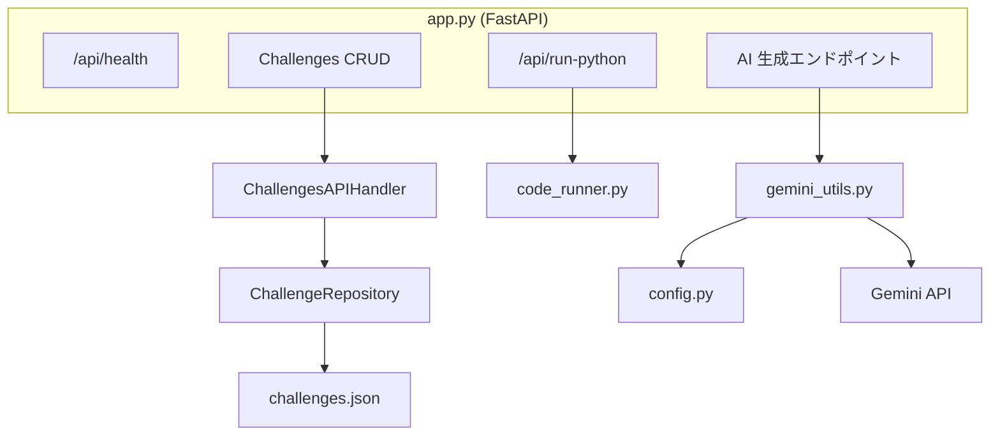
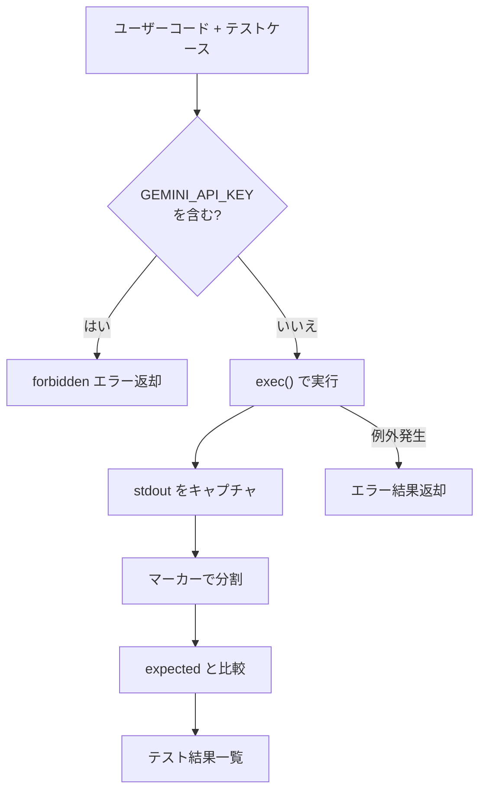
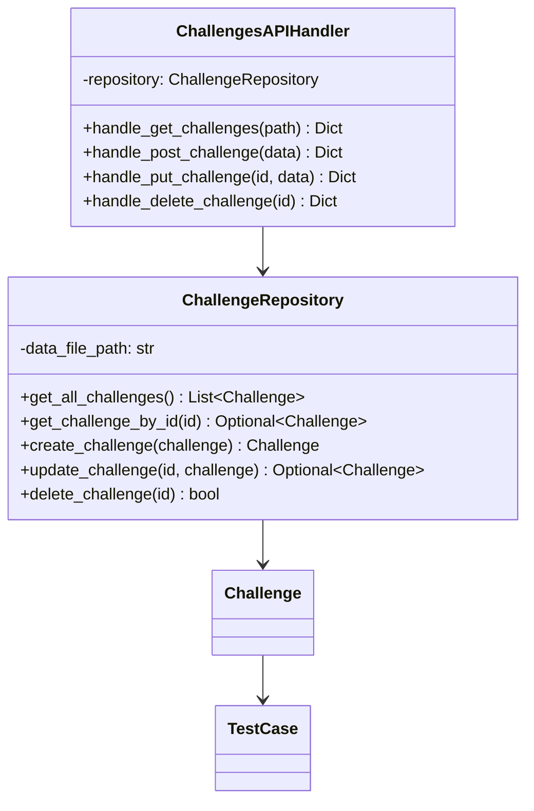

# バックエンド設計

## 概要

バックエンドは **Python 3.13 + FastAPI** で構築された REST API サーバーです。チャレンジデータの管理、ユーザーコードの実行、Gemini API を使った AI 機能を提供します。

## アプリケーション構成



### 主要ファイル

| ファイル | 責務 |
|---|---|
| `app.py` | FastAPI アプリケーション本体。全エンドポイントの定義 |
| `config.py` | 設定値（ポート、API キー、モデル名）とシステムプロンプト |
| `code_runner.py` | Python コード実行エンジン |
| `gemini_utils.py` | Gemini API のラッパーと JSON パース処理 |
| `api/challenges.py` | チャレンジ CRUD のビジネスロジック |
| `database/challenge_repository.py` | JSON ファイルベースのデータアクセス層 |
| `database/models/challenge.py` | データモデル定義 (`Challenge`, `TestCase`) |

## CORS 設定

```python
app.add_middleware(
    CORSMiddleware,
    allow_origins=["*"],       # 全オリジン許可 (開発用)
    allow_credentials=True,
    allow_methods=["*"],
    allow_headers=["*"],
)
```

> 本番環境ではオリジンを制限すべきです。

## コード実行エンジン

`code_runner.py` はユーザーが記述した Python コードをサーバーサイドで実行し、テスト結果を返します。

### 実行フロー



### テストケースマーカー

コードの標準出力に含まれる以下のマーカーで、テストケースごとの出力を分割します。

```
---- テストケース{i} ----
```

正規表現: `----\s*テストケース\s*(\d+)\s*----`

マーカーが検出できない場合は、全テストケースに対してエラーが返されます。

### セキュリティ対策

- コードに `"GEMINI_API_KEY"` という文字列が含まれている場合、実行を拒否し `forbidden` ステータスを返します。
- コード実行は `exec()` を使用し、キャプチャした名前空間で実行されます。

## データアクセス層

### リポジトリパターン

`ChallengeRepository` は JSON ファイルベースのデータ永続化を行います。



- データファイルのパス: `database/data/challenges.json`
- ファイルが存在しない場合は自動的に空配列で初期化
- 読み書きのたびにファイル全体をロード/セーブ

### API ハンドラ

`ChallengesAPIHandler` はリポジトリとエンドポイントの間を仲介し、統一的なレスポンス形式 (`{status, data}` or `{status, error}`) を返します。

## エラーハンドリング

| シナリオ | HTTP ステータス | 説明 |
|---|---|---|
| 正常な取得 | 200 | データを `data` フィールドに格納 |
| 作成成功 | 201 | 作成されたデータを `data` フィールドに格納 |
| バリデーションエラー | 400 | 必須フィールドが不足している場合 |
| データ未検出 | 404 | 指定 ID のチャレンジが存在しない場合 |
| ID 重複 | 409 | 同じ ID のチャレンジが既に存在する場合 |
| AI 生成失敗 | 500 | Gemini API 呼び出しに失敗した場合 |
| コード実行エラー | - | SSE ペイロード内に `status: "error"` で返却 |

## 関連ドキュメント

- API エンドポイントの詳細 → [api-reference.md](./api-reference.md)
- データモデル → [data-model.md](./data-model.md)
- AI 連携の仕組み → [ai-integration.md](./ai-integration.md)
- 全体アーキテクチャ → [architecture.md](./architecture.md)
