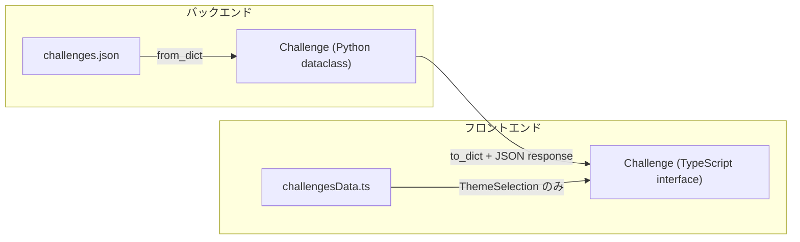

# データモデル

## 概要

Debug Master では、同じ「チャレンジ」データを Python (バックエンド) と TypeScript (フロントエンド) の双方で扱います。永続化には JSON ファイルを使用し、SQL データベースは使用していません。

## バックエンド (Python)

データモデルは `dataclass` で定義されています。

ファイル: `backend/database/models/challenge.py`

### TestCase

```python
@dataclass
class TestCase:
    input: Any       # テスト入力値 (文字列または数値)
    expected: Any    # 期待される出力値
```

### Challenge

```python
@dataclass
class Challenge:
    id: str                    # 一意な識別子 (例: "hello-world")
    title: str                 # タイトル (例: "はじめてのプログラム")
    description: str           # 短い説明文
    difficulty: str            # 難易度 (例: "入門", "初級")
    image: str                 # サムネイル画像パス
    languages: List[str]       # 対応言語 (例: ["Python"])
    instructions: str          # 問題の仕様
    examples: str              # 入出力例
    video: str                 # 解説動画パス
    testCases: List[TestCase]  # テストケース一覧
```

両クラスには `to_dict()` と `from_dict()` メソッドがあり、JSON との相互変換を行います。

## フロントエンド (TypeScript)

### 基本型

ファイル: `frontend/src/types/challenge.ts`

```typescript
interface TestCase {
  input: any;       // テスト入力値
  expected: any;    // 期待される出力値
}

interface Challenge {
  id: string;
  title: string;
  description: string;
  difficulty: string;
  image: string;
  languages: string[];
  instructions: string;
  examples: string;
  video: string;
  testCases: TestCase[];
}
```

### チャレンジエディタ関連の型

ファイル: `frontend/src/types/challengeEditor.ts`

```typescript
type HintLevel = {
  level: number;     // ヒントレベル (1-4)
  title?: string;    // ヒントのタイトル
  content: string;   // ヒント本文
};

type TestResult = {
  testCase: number;                                     // テストケース番号
  status: 'success' | 'failure' | 'forbidden' | 'error'; // 結果ステータス
  message?: string;                                      // メッセージ
  input?: any;                                           // 入力値
  expected_output?: string;                              // 期待出力
  actual_output?: string;                                // 実際の出力
};
```

### ヒント関連の定数

```typescript
const DEFAULT_HINT_TITLES: Record<number, string> = {
  1: '方向性のヒント',
  2: 'キーワードのヒント',
  3: '解法の骨子',
  4: '最終ヒント',
};

const HINT_LEVEL_COUNT = 4;
```

## JSON データ構造

### challenges.json

ファイル: `backend/database/data/challenges.json`

チャレンジデータの配列を格納する JSON ファイルです。`ChallengeRepository` がこのファイルを読み書きします。

```json
[
  {
    "id": "hello-world",
    "title": "はじめてのプログラム",
    "description": "自分の名前を表示するプログラムを作成します。Pythonの基本的な出力を学びましょう。",
    "difficulty": "入門",
    "image": "public/images/character.png?auto=format&fit=crop&w=800&q=80",
    "languages": ["Python"],
    "instructions": "自分の名前を「こんにちは、〇〇です！」の形で表示する関数を作成してください。...",
    "examples": "例:\nname = \"花子\"\n出力: こんにちは、花子です！",
    "video": "/videos/hello-world.mp4",
    "testCases": [
      { "input": "太郎", "expected": "こんにちは、太郎です！" },
      { "input": "花子", "expected": "こんにちは、花子です！" }
    ]
  }
]
```

`input` と `expected` は文字列または数値です。テスト比較時には `str(...).strip()` で文字列化してから比較されます。

### challengesData.ts (フロントエンド静的データ)

ファイル: `frontend/src/challengesData.ts`

`ThemeSelection` コンポーネント（ホーム画面）で使用される静的なチャレンジ一覧です。以下の 6 つのチャレンジが定義されています。

| ID | タイトル | 難易度 |
|---|---|---|
| `hello-world` | はじめてのプログラム | 入門 |
| `age-calculator` | 年齢計算プログラム | 入門 |
| `temperature-judge` | 温度判定プログラム | 初級 |
| `sum-n` | 合計値計算プログラム | 初級 |
| `reverse-string` | 文字列反転プログラム | 初級 |
| `multiplication-table` | 掛け算九九プログラム | 初級 |

> **重要**: `challengesData.ts` の `id` と `challenges.json` の `id` は一致している必要があります。ホーム画面では静的データを使ってカードを描画し、チャレンジ画面では API 経由でデータを取得するためです。

## フロントエンド/バックエンド間のデータマッピング



フィールド名はフロントエンドとバックエンドで完全に一致しています（camelCase: `testCases`）。

## 関連ドキュメント

- API レスポンス形式 → [api-reference.md](./api-reference.md)
- バックエンドの実装 → [backend.md](./backend.md)
- フロントエンドの型の利用箇所 → [frontend.md](./frontend.md)
