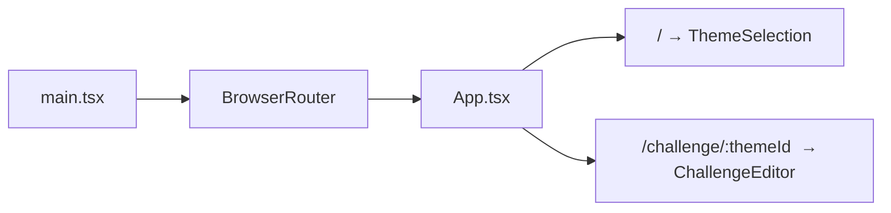
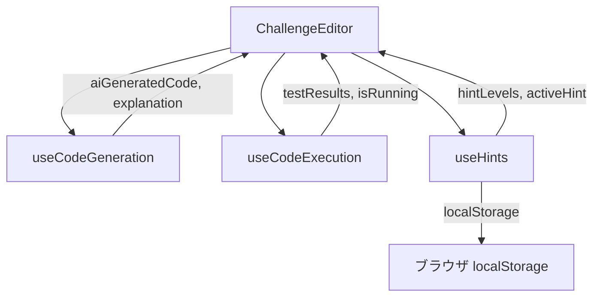

# フロントエンド設計

## 概要

フロントエンドは **React 18 + TypeScript + Vite 5** で構築された SPA (Single Page Application) です。スタイリングには Tailwind CSS を使用し、コードエディタには CodeMirror 6 を統合しています。

## ルーティング

`react-router-dom` を使い、2 つのルートで構成されています。

| パス | コンポーネント | 説明 |
|---|---|---|
| `/` | `ThemeSelection` | ホーム画面。ミッション（チャレンジ）の一覧をカード形式で表示 |
| `/challenge/:themeId` | `ChallengeEditor` | チャレンジ画面。コードエディタ + テスト実行 + ヒント |



ルーティング定義は `frontend/src/App.tsx` にあります。マウント時にバックエンドの `GET /api/health` を呼んで接続確認を行います。

## コンポーネント構成

### 主要コンポーネント

| コンポーネント | ファイル | 責務 |
|---|---|---|
| **ThemeSelection** | `components/ThemeSelection.tsx` | チャレンジ選択画面。`challengesData.ts` の静的データからカードを描画 |
| **ChallengeEditor** | `ChallengeEditor.tsx` | メインのチャレンジ画面。エディタ、テスト結果、モーダル、進捗バーを統合 |
| **HintModal** | `components/HintModal.tsx` | ヒント表示ダイアログ。レベル 1-4 の段階的ヒント、リセット、最終ヒント確認 |
| **HintContentRenderer** | `components/HintContentRenderer.tsx` | ヒントテキストのレンダリング（インラインコード、コードブロック） |
| **SuccessModal** | `components/SuccessModal.tsx` | 成功時モーダル。修正理由と差分の解説を表示 |
| **RetireConfirmationModal** | `components/RetireConfirmationModal.tsx` | リタイア確認ダイアログ |
| **RetireModal** | `components/RetireModal.tsx` | リタイア解説モーダル。正解コードと解説を表示 |
| **VideoModal** | `components/VideoModal.tsx` | 問題解説動画の再生モーダル |
| **TestResults** | `components/TestResults.tsx` | テスト結果一覧の表示 |
| **ProgressBar** | `components/ProgressBar.tsx` | 4 ステップの進捗表示 |
| **Markdown** | `components/Markdown.tsx` | Markdown レンダリング (react-markdown + Prism) |
| **Modal** | `components/Modal.tsx` | 汎用モーダルラッパー |
| **Button** | `components/Button.tsx` | スタイル付きボタン (primary / secondary / ghost) |

### ChallengeEditor の構造

`ChallengeEditor` はチャレンジ画面の中心となるコンポーネントで、以下の要素を統合しています。

```
ChallengeEditor
├── SuccessModal (条件付き表示)
├── HintModal (常時レンダリング、条件付き表示)
├── フローティングキャラクター (ヒントボタン)
├── VideoModal (条件付き表示)
├── RetireConfirmationModal (条件付き表示)
├── RetireModal (条件付き表示)
├── ヘッダー (ロゴ + ホームリンク)
├── ProgressBar (4 ステップ)
├── 問題エリア (仕様、入出力例、動画リンク、ヒントガイド)
├── AI 生成ステータス (条件付き表示)
├── コードエディタ (CodeMirror) + テスト結果 (左右分割)
└── テスト実行 / リタイアボタン
```

## カスタムフック

3 つのカスタムフックで主要なロジックを分離しています。

### `useCodeGeneration` (`hooks/useCodeGeneration.ts`)

AI によるバグ入りコード生成を管理します。

| 戻り値 | 型 | 説明 |
|---|---|---|
| `isGenerating` | `boolean` | 生成中かどうか |
| `generationError` | `string` | エラーメッセージ |
| `explanation` | `string` | AI によるバグの説明 |
| `aiGeneratedCode` | `string \| null` | AI が生成したコード |
| `lastFailingCode` | `string \| null` | 最後に失敗したコード |
| `handleGenerateCode` | `function` | コード生成を実行 |

### `useCodeExecution` (`hooks/useCodeGeneration.ts` 内)

Python コードの実行とテスト結果の管理を行います。`POST /api/run-python` に対して SSE (Server-Sent Events) でテスト結果をストリーミング受信します。

| 戻り値 | 型 | 説明 |
|---|---|---|
| `isRunning` | `boolean` | 実行中かどうか |
| `testResults` | `TestResult[]` | テスト結果の配列 |
| `handleRunCode` | `function` | コード実行を開始 |
| `getPassingTestsCount` | `function` | 成功テスト数を取得 |

### `useHints` (`hooks/useHints.ts`)

4 段階のヒントシステムを管理します。ヒントの進捗は `localStorage` に永続化されます。

| 機能 | 説明 |
|---|---|
| ヒント取得 | `POST /api/generate-hint` を呼び出してヒントを取得 |
| 段階的開放 | レベル 1 から順にアンロック。レベル 4 は確認ダイアログ付き |
| 永続化 | `localStorage` に `hint-progress-{challengeId}` キーで保存 |
| リセット | ヒントを再生成し、進捗をリセット |

## CodeMirror 統合

`ChallengeEditor.tsx` 内で `@uiw/react-codemirror` を直接使用しています。

```typescript
import CodeMirror from '@uiw/react-codemirror';
import { python } from '@codemirror/lang-python';
import { oneDark } from '@codemirror/theme-one-dark';
import { indentUnit } from '@codemirror/language';

<CodeMirror
  value={code}
  onChange={(value) => setCode(value)}
  height="100%"
  extensions={[python(), oneDark, indentUnit.of('    ')]}
/>
```

- **言語サポート**: Python (`@codemirror/lang-python`)
- **テーマ**: One Dark (`@codemirror/theme-one-dark`)
- **インデント**: 4 スペース

## 状態管理

Redux や Zustand などの外部ライブラリは使用していません。コンポーネントローカルの `useState` とカスタムフックの組み合わせで状態を管理しています。



## データソース

`ThemeSelection` コンポーネントは `challengesData.ts` の静的データを使用しますが、`ChallengeEditor` は API (`GET /api/challenges/{id}`) からチャレンジデータを取得します。両者の `id` が一致している必要があります。

## UI/UX

- **アイコン**: Lucide React
- **カラーテーマ**: パープル / ピンク / インディゴのグラデーション
- **アニメーション**: `index.css` にカスタムキーフレーム定義 (`fade-in`, `bounce`, `pop-in`, `float`, `wiggle`, `sparkle` など)
- **レスポンシブ**: Tailwind の `lg:grid-cols-2`, `lg:grid-cols-3` などでグリッドレイアウト
- **アクセシビリティ**: ヒントモーダルに `aria-*` 属性、フォーカストラップ、Escape キーで閉じる
- **言語**: UI テキストはすべて日本語

## 関連ドキュメント

- API エンドポイント → [api-reference.md](./api-reference.md)
- 型定義 → [data-model.md](./data-model.md)
- 全体アーキテクチャ → [architecture.md](./architecture.md)
